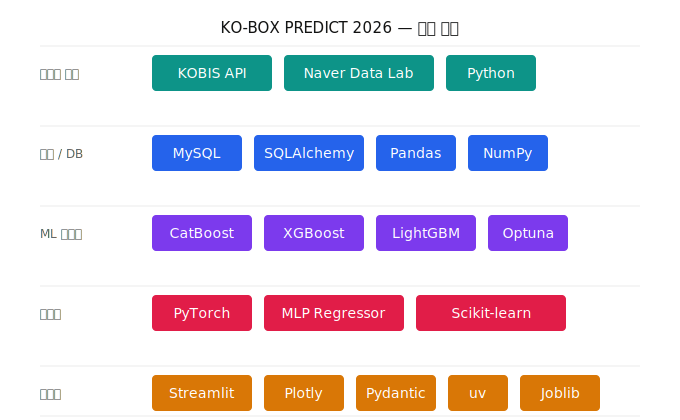

# SKN30-2nd-4Team

# 🎬 KO-BOX PREDICT 2026
### 개봉 예정작 흥행 예측 & 스크린 배급 시뮬레이터

> 과거 8년간의 KOBIS 박스오피스 및 Naver 검색 트렌드 데이터를 학습한 **2-Stage AI 앙상블 모델**로,  
> 개봉 전 콘텐츠 잠재력을 진단하고 배급 전략에 따른 예상 관객수를 실시간 시뮬레이션합니다.

🔗 **Live Demo**: [machine-dongjin.streamlit.app](https://machine-dongjin.streamlit.app/)

---

## 👥 팀원

| 이름 | 역할 |
|:---:|:---:|
|  |  |
|  |  |
|  |  |
|  |  |
|  |  |

---

## 📌 프로젝트 개요

영화 산업은 수십~수백억 원이 투입되는 고위험 산업임에도 흥행 예측이 주로 경험과 직관에 의존해 왔습니다.  
본 프로젝트는 **개봉 전에 확보 가능한 정보만**으로 누적 관객수를 예측하고, 스크린 배급 규모에 따른 관객 변화를 시뮬레이션하는 의사결정 보조 도구를 구축합니다.

**핵심 해결 과제**: 개봉 첫날 스크린 수는 흥행 결과에 강하게 영향을 미치지만, 동시에 영화의 잠재력에 의해 결정되는 내생 변수입니다. 이 **내생성(Endogeneity) 문제**를 2-Stage 구조로 분리하여 해소합니다.

---

## 🛠️ 기술 스택



---

## 🏗️ 2-Stage 모델 아키텍처

```
Stage 1 — 콘텐츠 잠재력 모델 (순수 영화의 힘)
  Input  →  개봉 전 피처 (감독/배우 스타파워, 장르, 사전 검색 버즈, 시즌 등)
  Output →  pred_potential (스크린 배급 요인이 완전히 배제된 순수 흥행 잠재 점수)
                              │
                              ▼
Stage 2 — 배급 스케일 보정 모델 (What-If 시뮬레이터)
  Input  →  pred_potential  +  scrnCnt_day1  +  showCnt_day1
  Output →  최종 예상 누적 관객수  (단조 증가 제약 XGBoost)
```

| 항목 | Stage 1 | Stage 2 |
|:---|:---|:---|
| 목적 | 콘텐츠 고유 흥행 체급 진단 | 배급 규모에 따른 관객수 보정 |
| 모델 | CatBoost 80% + XGBoost 20% Stacking | XGBoost (Monotonic Constraints) |
| 최종 성능 | R² 0.5638 / RMSE 1.3459 | R² 0.5517 / RMSE 1.3645 |

---

## 📊 모델 학습 결과 요약

### Baseline 비교 (시계열 분할 기준)

| 모델 | R² | RMSE(log) | MAE(실제 관객수) |
|:---|---:|---:|---:|
| Linear Regression | 0.5304 | 1.3965 | 96.6만 명 |
| Ridge | 0.5306 | 1.3962 | 95.9만 명 |
| Lasso | 0.5414 | 1.3801 | 87.2만 명 |
| RandomForest | 0.4993 | 1.4420 | **31.8만 명** |

### 최종 모델 비교 (시계열 분할 기준)

| 모델 | R² | RMSE |
|:---|:---:|:---:|
| RandomForest | 0.4904 | 1.4548 |
| MLP (DL) | 0.5069 | 1.4310 |
| LightGBM | 0.5180 | 1.4148 |
| XGBoost | 0.5517 | 1.3645 |
| CatBoost | 0.5633 | 1.3467 |
| **✅ CatBoost 8 : XGBoost 2 앙상블** | **0.5638** | **1.3459** |

> 무작위 랜덤 분할이 아닌 **개봉일 기준 시계열 분할**을 적용하여 실전 배포 환경과 동일한 조건에서 평가하였습니다.

### 주요 예측 피처 (상관계수 기준 Top 5)

| 순위 | 피처 | 설명 |
|:---:|:---|:---|
| 1 | `relative_search_share` | 동기간 경쟁작 대비 상대 검색 점유율 |
| 2 | `distributor_avg_audi` | 배급사 과거 평균 흥행 이력 |
| 3 | `trend_pre7_avg` | 개봉 전 7일 평균 검색 트렌드 |
| 4 | `trend_pre7_max` | 개봉 전 7일 최대 검색량 |
| 5 | `is_new_director` | 신인 감독 여부 |

---

## 🗂️ 데이터 수집 개요

- **수집 기간**: 2010년 ~ 2025년 (16년)
- **수집 소스**: 영화진흥위원회(KOBIS) Open API + 네이버 데이터랩 검색 트렌드 API
- **최종 학습 데이터**: v3 피처셋 기준 **2,489편 × 43컬럼**

| 테이블 | 적재 건수 | 설명 |
|:---|:---:|:---|
| `movies` | 3,943건 | 영화 기본 메타데이터 |
| `daily_box_office` | 58,440건 | 일별 박스오피스 실적 |
| `people` / `movie_casting` | 18,279 / 50,575건 | 영화인 정보 및 캐스팅 매핑 |
| `naver_search_trend` | 83,575건 | 개봉 전 30일 일별 검색 트렌드 |

---

## 🖥️ Streamlit 대시보드 주요 기능

1. **콘텐츠 잠재력 진단 카드** — 배급 변수를 완전히 배제한 순수 흥행 체급 점수
2. **What-If 스크린 시뮬레이터** — 체급·장르 기반 이중 가드레일 슬라이더로 안전한 범위 내 시뮬레이션
3. **스크린 규모별 반응 곡선** — 스크린 수 증가에 따른 한계 효율 체감 시각화
4. **Elbow Point 추천** — 최대 관객의 90%를 달성하는 최소 스크린 확보 임계점 자동 산출
5. **피처 기여도 Top 10** — CatBoost 80% + XGBoost 20% 가중 중요도 한글화 출력

---

## 🚀 실행 방법

```bash
# 로컬 실행
uv run streamlit run web/app.py --server.port 8515
```

**Streamlit Cloud 배포 설정**

| 항목 | 값 |
|:---|:---|
| Repository | `SKNETWORKS-FAMILY-AICAMP/SKN30-2nd-4Team` |
| Branch | `main` |
| Main file path | `main.py` |

---

## 📁 프로젝트 구조

```
SKN30-2nd-4Team/
├── main.py                     # Streamlit Cloud 배포 엔트리포인트
├── pyproject.toml              # 의존성 관리
│
├── data/
│   ├── api/                    # KOBIS & Naver API 클라이언트
│   └── db/                     # MySQL DB 마이그레이션 및 적재
│
├── ml/
│   ├── 00_feature_table_v3.ipynb
│   ├── 01_eda_baseline.ipynb
│   ├── 02_boosting.ipynb
│   ├── 03_deep_learning.ipynb
│   └── 04_model_comparison.ipynb
│
└── web/
    ├── app.py                  # Streamlit UI 오케스트레이터
    ├── stage1_ensemble.pkl     # Stage 1 앙상블 모델
    ├── stage2_simulator.pkl    # Stage 2 시뮬레이터 모델
    └── utils/
        ├── loader.py           # 모델 & 데이터 캐싱
        ├── predictor.py        # 2-Stage 추론 & Elbow Point 연산
        └── styles.py           # CSS 테마 & 피처 한글화 사전
```

---

## 📄 산출 문서

- [인공지능 데이터 전처리 결과서](docs/인공지능%20데이터%20전처리%20결과서.md)
- [인공지능 학습 결과서](docs/인공지능%20학습%20결과서.md)
