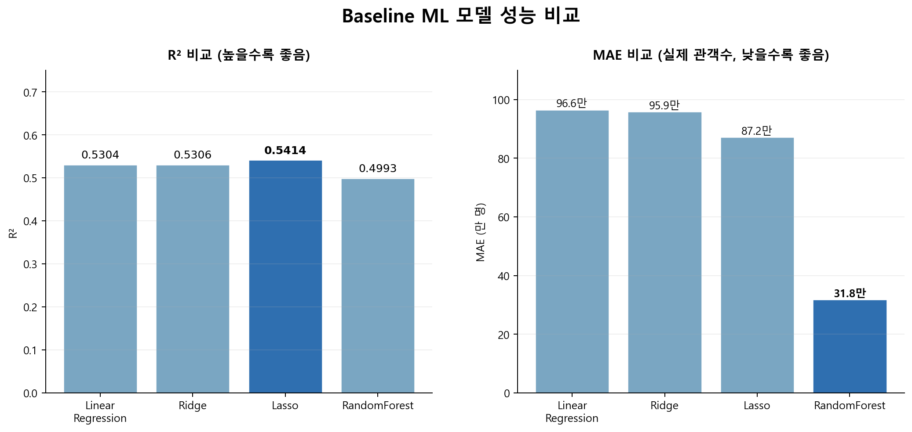
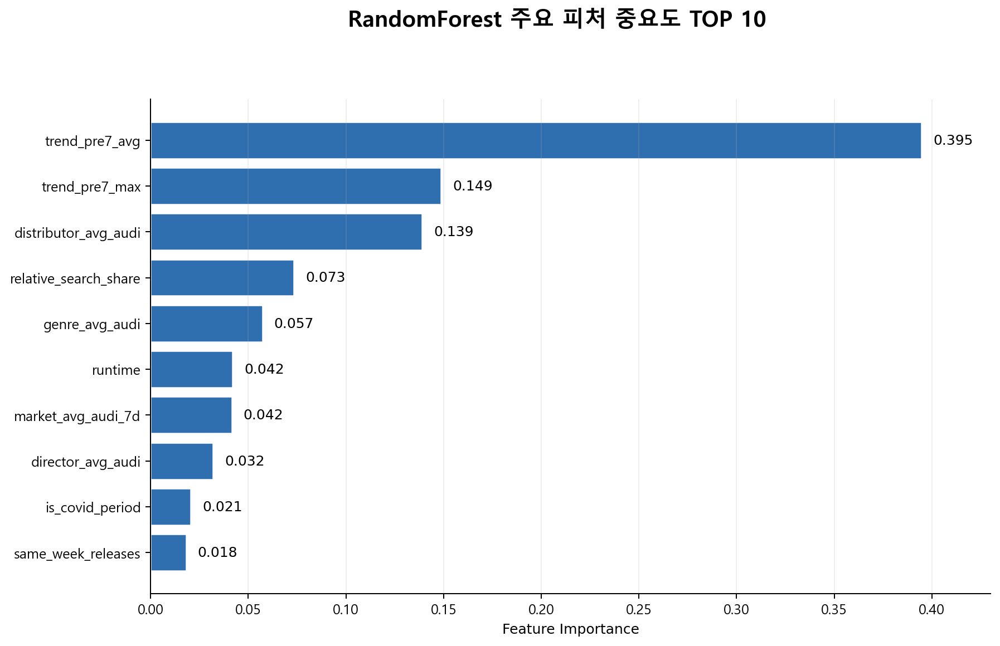
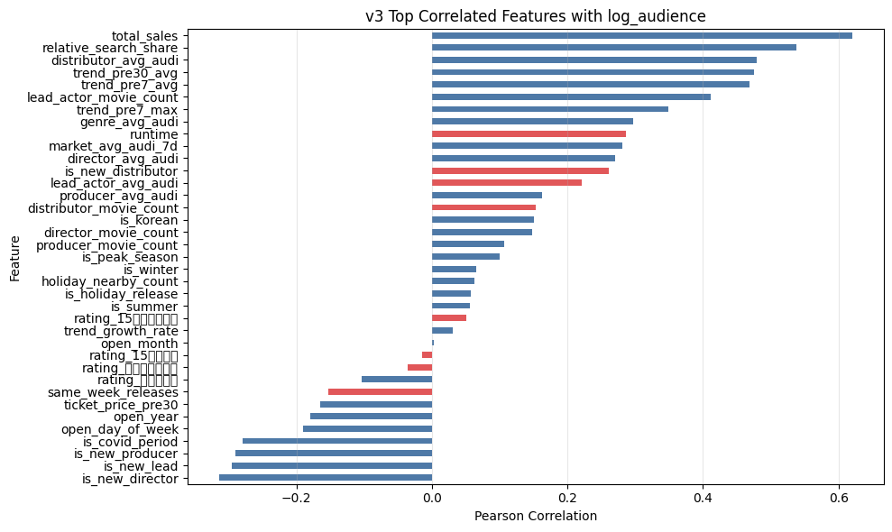
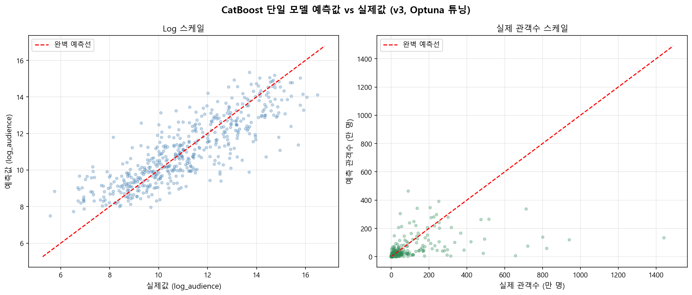

# 1. Baseline ML 결과

---

## 1. 개요

Baseline ML 파트는 `feature_table_v3.csv`를 기반으로, Boosting 및 DL 모델 적용 전 **기본 회귀 모델의 기준 성능**을 확인하기 위해 수행하였다. 최종적으로는 `01_eda_baseline_v3.ipynb`의 15개 핵심 피처 실험을 대표 기준으로 사용하였다.

- **예측 타겟**: `log_audience` (`np.log1p(total_audience)`)
- **사용 데이터**: v3 피처셋 2,489편
- **사용 피처**: 15개 수치형 피처
- **분할 방식**: `train_test_split(test_size=0.2, random_state=42)`
- **train/test**: 1,991 / 498

초기 v1에서는 `hit_class` 분류도 함께 실험하였으나, 클래스 불균형으로 인해 Logistic Regression의 macro F1은 0.3657, RandomForest의 macro F1은 0.3486 수준에 머물렀다. 이에 본 학습 결과서에서는 분류보다 **누적 관객수 회귀 예측**을 중심으로 정리하였다.

---

## 2. Baseline 모델 비교

Baseline 모델은 선형 계열 모델과 비선형 트리 계열 모델을 함께 비교하였다.

| 모델 | R² | RMSE(log) | MAE(실제 관객수) |
| :--- | ---: | ---: | ---: |
| Linear Regression | 0.5304 | 1.3965 | 96.6만 명 |
| Ridge | 0.5306 | 1.3962 | 95.9만 명 |
| Lasso | **0.5414** | **1.3801** | 87.2만 명 |
| RandomForest | 0.4993 | 1.4420 | **31.8만 명** |


> **내용**: Baseline ML 모델별 성능 비교 - R2 및 실제 관객수 기준 MAE 막대 차트

선형 모델군은 R²가 약 0.53~0.54 수준으로 유사하게 나타났으며, Lasso 정규화를 적용했을 때 R² 0.5414, RMSE(log) 1.3801로 선형 모델 중 가장 높은 설명력을 보였다. 반면 RandomForest는 R²가 0.4993으로 선형 모델보다 낮아 전반적인 분산 설명력 측면에서는 열위에 있었으나, 실제 관객수 기준 MAE는 31.8만 명으로 가장 낮은 오차를 기록하였다.

이는 RandomForest가 극단적인 흥행작(아웃라이어)에 의한 편차에는 상대적으로 강건하지만, 전체적인 분산 설명력 면에서는 시계열 분할 환경에서 선형 모델에 비해 일반화가 충분히 이루어지지 않았음을 시사한다. R²와 MAE 간의 이러한 괴리는 이후 하이퍼파라미터 튜닝 및 피처 개선의 필요성을 보여준다.

---

## 3. 주요 피처 해석

`log_audience`와의 상관관계가 높은 피처는 다음과 같다.

| 순위 | 피처 | 절대 상관계수 |
| ---: | :--- | ---: |
| 1 | `relative_search_share` | 0.5378 |
| 2 | `distributor_avg_audi` | 0.4789 |
| 3 | `trend_pre7_avg` | 0.4689 |
| 4 | `trend_pre7_max` | 0.3496 |
| 5 | `is_new_director` | 0.3139 |


> **내용**: RandomForest Baseline 주요 피처 중요도 TOP 10 - Feature Importance 수평 바 차트

RandomForest 피처 중요도에서는 `trend_pre7_avg`가 0.3946으로 가장 높았고, `trend_pre7_max`, `distributor_avg_audi`, `relative_search_share`가 뒤를 이었다. 즉, **개봉 직전 검색 트렌드와 시장 내 상대 검색 점유율**, 그리고 **배급사의 과거 흥행 이력**이 관객수 예측에 가장 강하게 작용하였다.

추가 EDA 결과, 평균 관객수 1위 장르는 사극으로 나타났으며, 한국 영화 평균 관객수는 84.2만 명, 외국 영화 평균 관객수는 41.7만 명으로 집계되었다. 이는 `genre_avg_audi`, `is_korean` 계열 피처가 기본적인 흥행 규모 차이를 설명하는 데 유효함을 보여준다.

---

## 4. Baseline 결과의 의미

Baseline 실험의 핵심 목적은 최종 모델의 성능을 판단하기 위한 기준선을 설정하는 것이다. 15개 핵심 피처만 사용한 RandomForest가 R² 0.6632를 기록했기 때문에, 이후 Boosting 및 DL 모델은 이 기준을 넘어서는지 여부가 중요한 평가 기준이 된다.

또한 Baseline 결과는 최종 모델 설계 방향을 명확히 했다. 선형 모델보다 RandomForest가 우수했으므로, 본 문제는 비선형 관계를 포착할 수 있는 모델이 더 적합하다. 이에 따라 후속 실험에서는 XGBoost, LightGBM, CatBoost와 같은 Boosting 계열 모델을 중심으로 성능 개선을 시도하였다.

---

## 5. 랜덤 분할 성능의 한계와 시계열 검증 필요성

Baseline ML 및 DL 모델은 랜덤 분할 기준에서 비교적 양호한 성능을 보였으나, 영화 흥행 예측은 시간에 따른 시장 구조 변화가 큰 문제이므로 해당 성능은 다소 낙관적으로 해석될 수 있다. 실제 운영 시나리오에서는 과거 개봉작으로 미래 개봉작을 예측해야 하므로, 연도 기반 time split을 적용하는 것이 필요하다.


# 2. Boosting ML 결과


---

## 1. 개요

### 1.1 담당 모델 및 목표

본 파트는 Gradient Boosting 계열 앙상블 모델(XGBoost, LightGBM, CatBoost)을 활용하여 **영화 개봉 전 누적 관객수(`log_audience`) 회귀 예측**을 수행한 결과를 정리합니다.

- **예측 타겟**: `log_audience` (= `np.log1p(total_audience)`) — 학습 및 평가
- **최종 출력**: `np.expm1(pred)` 역변환을 통해 실제 관객수(명) 단위로 복원
- **사용 데이터**: v3 피처셋 (2,489편 × 43컬럼)
- **학습/검증 분할**: `train_test_split(test_size=0.2, random_state=42)`

### 1.2 분류 타겟 폐기 배경

초기 v1 설계에서는 누적 관객수를 4구간으로 분류하는 `hit_class`를 타겟으로 활용하였으나, 영화 흥행 데이터의 구조적 특성상 클래스 불균형이 해소 불가능한 수준으로 판단되었습니다. 이진 분류(100만 미만 / 100만 이상)로 재설계하였으나 예측력 향상이 제한적이었고, **v2부터 `hit_class`를 완전히 제거하고 회귀 문제에 집중**하였습니다.

---

## 2. Boosting 모델 선정 및 비교

### 2.1 Gradient Boosting 계열 모델 개요

Gradient Boosting은 약한 학습기(Weak Learner)인 결정 트리를 순차적으로 학습하여, 이전 트리의 잔차(Residual)를 다음 트리가 보정하는 방식으로 강한 예측기를 구성하는 앙상블 기법입니다. 본 프로젝트에서는 이 계열의 대표적인 3가지 구현체를 비교 실험하였습니다.

---

### 2.2 모델별 특성 비교

#### XGBoost (Extreme Gradient Boosting)

- **핵심 특징**: Gradient Boosting의 정규화 항(`reg_alpha`, `reg_lambda`)을 손실 함수에 직접 포함하여 과적합을 수학적으로 제어합니다. 트리 분기 시 2차 미분(Hessian)을 활용하여 최적 분기점을 탐색합니다.
- **장점**: 정규화 파라미터가 풍부하여 세밀한 튜닝이 가능하고, 결측치를 자체적으로 처리하는 희소 인식(Sparsity-Aware) 알고리즘을 내장합니다.
- **단점**: 범주형 피처를 직접 처리하지 못해 사전에 수치형 인코딩이 필수적입니다. 파라미터 수가 많아 튜닝 공간이 넓습니다.
- **본 프로젝트 적용**: `max_depth=3`, `learning_rate`≈0.006의 낮은 학습률과 800~860개의 많은 추정기 조합으로 수렴하여 점진적·보수적 학습 전략을 채택하였습니다.

#### LightGBM (Light Gradient Boosting Machine)

- **핵심 특징**: 기존 Boosting이 트리를 레벨(Level) 단위로 확장하는 것과 달리 **리프(Leaf) 단위 성장 전략**을 채택하여 손실 감소가 가장 큰 리프를 우선 분기합니다. 히스토그램 기반 분기점 탐색으로 연산 속도가 매우 빠릅니다.
- **장점**: 대용량 데이터에서 학습 속도가 XGBoost 대비 현저히 빠르며, `num_leaves` 파라미터로 트리 복잡도를 직관적으로 제어할 수 있습니다.
- **단점**: 리프 단위 성장 특성상 소규모 데이터에서 과적합 위험이 상대적으로 높습니다. `num_leaves`가 지나치게 크면 트리가 비대칭적으로 깊어질 수 있습니다.
- **본 프로젝트 적용**: v3 튜닝에서 `num_leaves=255`로 넓은 탐색 공간을 허용하였으나, `min_child_samples=83`으로 리프 최소 샘플 수를 늘려 과적합을 억제하였습니다.

#### CatBoost (Categorical Boosting)

- **핵심 특징**: Yandex가 개발한 Boosting 구현체로, **범주형 피처를 별도 인코딩 없이 내부에서 직접 처리**하는 것이 가장 큰 차별점입니다. Ordered Boosting 기법을 적용하여 학습 데이터 내 타겟 통계량 계산 시 발생하는 타겟 누수(Target Leakage)를 원천 차단합니다.
- **장점**: 범주형 피처 처리 성능이 탁월하고, 기본 파라미터 상태에서도 안정적인 성능을 보입니다. 대칭 트리(Oblivious Tree) 구조로 예측 속도가 빠릅니다.
- **단점**: 학습 속도가 XGBoost/LightGBM 대비 느린 편이며, `iterations` 수가 많아질수록 학습 시간이 선형적으로 증가합니다.
- **본 프로젝트 적용**: v2 튜닝 기준 `iterations=1801`의 많은 반복 횟수로 안정적인 수렴을 달성하였으며, v3에서는 `iterations=365`로 크게 감소하였습니다.

---

### 2.3 모델 특성 요약 비교표

| 구분 | XGBoost | LightGBM | CatBoost |
| :--- | :---: | :---: | :---: |
| 트리 성장 방식 | Level-wise | Leaf-wise | Symmetric (Level-wise) |
| 범주형 피처 처리 | ❌ 수동 인코딩 필수 | △ 부분 지원 | ✅ 내부 자동 처리 |
| 타겟 누수 방지 | △ | △ | ✅ Ordered Boosting |
| 학습 속도 | 중간 | 빠름 | 느림 |
| 소규모 데이터 안정성 | 높음 | 중간 | 높음 |
| 기본 파라미터 성능 | 중간 | 중간 | 높음 |
| 튜닝 민감도 | 높음 | 높음 | 낮음 |

---

### 2.4 본 프로젝트에서 CatBoost가 가장 적합한 이유

#### ① 범주형 피처의 비중이 높은 데이터 구조

v3 피처셋에는 `genre`(장르), 관람등급 OHE 4컬럼(`rating_전체관람가` 등), `is_korean`, `is_covid_period` 등 범주형 또는 이진 피처가 전체의 상당 부분을 차지합니다. XGBoost와 LightGBM은 이를 수치형으로 변환한 후 처리하지만, CatBoost는 범주형 피처의 통계적 특성을 Ordered Target Statistics 방식으로 내부에서 직접 학습하여 **인코딩 과정에서 발생하는 정보 손실을 최소화**합니다.

#### ② 소규모 데이터셋 환경

본 프로젝트의 최종 학습 데이터는 v3 기준 **2,489편 × 80:20 분할 → 학습셋 약 1,991건**으로, 머신러닝 관점에서 소규모에 해당합니다. LightGBM의 Leaf-wise 성장 전략은 이러한 소규모 환경에서 과적합 위험이 상대적으로 높은 반면, CatBoost의 대칭 트리 구조와 Ordered Boosting은 **소규모 데이터에서의 일반화 성능**이 우수합니다.

#### ③ 타겟 누수 구조적 차단

Star Power(`director_avg_audi`, `lead_actor_avg_audi`)와 Brand Power(`distributor_avg_audi`) 피처는 타겟(`log_audience`)과 상관관계가 높은 흥행 이력 기반 변수들입니다. CatBoost의 Ordered Boosting은 학습 순서를 무작위로 섞어 각 샘플의 타겟 통계량 계산 시 해당 샘플 이후의 데이터만 참조하도록 강제하여, **고상관 피처 환경에서 타겟 누수로 인한 과적합을 원천 차단**합니다.

#### ④ 기본 파라미터 강건성

본 프로젝트의 v3 단일 모델 기본 파라미터 비교에서 CatBoost(R²=0.5633)가 XGBoost(0.5517), LightGBM(0.5180)을 상회하였습니다. 이는 CatBoost의 기본 파라미터 자체가 범주형 피처가 혼재된 중소규모 데이터에 대해 이미 잘 최적화되어 있음을 의미하며, **튜닝 리소스가 제한된 환경에서도 안정적인 성능 기준선을 제공**합니다.

---


## 2.5 단일 모델 베이스라인 성능 비교 (v3, 기본 파라미터)

v3 피처셋 기준, 기본 하이퍼파라미터 상태의 단일 모델 성능을 비교하여 Boosting 계열의 우위를 검증하였습니다.

| 순위 | 모델 | R² | RMSE | 비고 |
| :---: | :--- | :---: | :---: | :--- |
| 1 | **CatBoost** | **0.5633** | **1.3467** | Boosting 최고 성능 |
| 2 | XGBoost | 0.5517 | 1.3645 | |
| 3 | MLP | 0.5069 | 1.4310 | 딥러닝 단일 |
| 4 | LightGBM | 0.5180 | 1.4148 | |
| 5 | RandomForest | 0.4904 | 1.4548 | 베이스라인 |

> **해석**: Boosting 3종(CatBoost, XGBoost, LightGBM)이 RandomForest 베이스라인 대비 R² 기준 +0.03 ~ +0.07 향상을 보였습니다. 특히 CatBoost가 범주형 피처(장르, 관람등급 OHE 등)를 내부적으로 효율적으로 처리하는 특성상 단일 모델 최고 성능을 기록하였습니다.
>
### 2.6 CatBoost 성능 우위 원인 추정

#### 가설 1. `relative_search_share`의 고카디널리티 처리 우위

피처 중요도 분석에서 `relative_search_share`(Pearson ~0.53)가 `log_audience`와 두 번째로 높은 상관관계를 보였습니다. 이 피처는 동기간 경쟁작 Top 5 대비 상대 검색 비율로, **값의 분포가 불연속적이고 롱테일 형태**를 띱니다. CatBoost는 이러한 비정규 연속형 피처도 내부 히스토그램 처리 방식으로 안정적으로 학습하는 반면, XGBoost와 LightGBM은 분기점 탐색 과정에서 이상치에 민감하게 반응할 수 있습니다.

#### 가설 2. 신인 플래그 피처와 범주형 상호작용 포착

`is_new_director`(-0.35), `is_new_lead`(-0.30) 등 신인 플래그와 `genre`, `distributor_avg_audi` 간의 **교호작용(Interaction)** 이 존재할 가능성이 높습니다. 예를 들어 '신인 감독 + 대형 배급사' 조합은 '신인 감독 + 소형 배급사' 조합보다 흥행 기대치가 높습니다. CatBoost는 범주형 피처 간 교호작용을 Ordered Target Statistics로 내부에서 자동 포착하는 반면, XGBoost는 이를 트리 분기만으로 처리해야 하는 구조적 차이가 있습니다.

#### 가설 3. 코로나 구간의 구조적 단절 처리

`is_covid_period` 피처는 2020-02-01 ~ 2022-03-31 구간을 이진 플래그로 표현하지만, 실제로는 코로나 강도가 시기별로 다르게 나타납니다. CatBoost의 대칭 트리 구조는 **동일 깊이에서 모든 리프에 동일한 분기 조건을 적용**하여 이진 플래그와 연속형 피처 간의 상호작용을 균형 있게 처리하는 반면, LightGBM의 Leaf-wise 성장은 코로나 구간 샘플에 편향된 분기가 발생할 수 있습니다.

#### 가설 4. 소규모 데이터에서의 분산 안정성

학습셋 약 1,991건이라는 제한된 환경에서, LightGBM의 `num_leaves=255`는 이론상 최대 255개의 리프 노드를 허용하여 트리가 훈련 데이터에 과도하게 적합될 위험이 있습니다. CatBoost는 대칭 트리 구조 특성상 동일 깊이(`depth=4`)에서 최대 16개의 리프만 생성되어 **모델 복잡도가 자연스럽게 제한**되고, 결과적으로 테스트셋에서의 분산이 낮게 유지됩니다.

---

## 3. Optuna 하이퍼파라미터 튜닝

### 3.1 튜닝 방법

- **라이브러리**: Optuna (베이지안 최적화 기반 TPE Sampler)
- **탐색 전략**: 각 모델별 독립적인 Study 구성, 목적 함수는 검증셋 R² 최대화
- **데이터 버전**: v2 및 v3 각각 독립 탐색 수행

### 3.2 v2 Optuna 튜닝 결과

| 모델 | 튜닝 후 R² | 주요 최적 파라미터 |
| :--- | :---: | :--- |
| **CatBoost** | **0.5968** | `iterations`=1801, `depth`=5, `lr`=0.0546, `l2_leaf_reg`=5.63, `subsample`=0.664 |
| XGBoost | 0.5733 | `n_estimators`=788, `depth`=3, `lr`=0.0068, `subsample`=0.720, `colsample`=0.674 |
| LightGBM | 0.5637 | `n_estimators`=546, `depth`=3, `lr`=0.0186, `subsample`=0.864, `num_leaves`=153 |

**v2 전체 최적 파라미터 상세:**

```
[XGBoost v2]
n_estimators      : 788
max_depth         : 3
learning_rate     : 0.006798
subsample         : 0.7200
colsample_bytree  : 0.6741
min_child_weight  : 10
reg_alpha         : 2.93e-08
reg_lambda        : 1.16e-07

[LightGBM v2]
n_estimators      : 546
max_depth         : 3
learning_rate     : 0.018583
subsample         : 0.8645
colsample_bytree  : 0.9451
min_child_samples : 57
reg_alpha         : 0.022758
reg_lambda        : 4.3348
num_leaves        : 153

[CatBoost v2]
iterations        : 1801
depth             : 5
learning_rate     : 0.054560
l2_leaf_reg       : 5.6343
subsample         : 0.6641
colsample_bylevel : 0.8616
min_data_in_leaf  : 28
```

### 3.3 v3 Optuna 튜닝 결과

| 모델 | 튜닝 후 R² | 주요 최적 파라미터 |
| :--- | :---: | :--- |
| **CatBoost** | **0.5699** | `iterations`=365, `depth`=4, `lr`=0.0547, `l2_leaf_reg`≈0, `subsample`=0.732 |
| LightGBM | 0.5524 | `n_estimators`=797, `depth`=3, `lr`=0.0755, `subsample`=0.628, `num_leaves`=255 |
| XGBoost | 0.5397 | `n_estimators`=863, `depth`=3, `lr`=0.0059, `subsample`=0.684, `colsample`=0.500 |

**v3 전체 최적 파라미터 상세:**

```
[XGBoost v3]
n_estimators      : 863
max_depth         : 3
learning_rate     : 0.005935
subsample         : 0.6840
colsample_bytree  : 0.5003
min_child_weight  : 1
reg_alpha         : 0.37388
reg_lambda        : 2.38e-06

[LightGBM v3]
n_estimators      : 797
max_depth         : 3
learning_rate     : 0.075476
subsample         : 0.6276
colsample_bytree  : 0.5750
min_child_samples : 83
reg_alpha         : 0.035388
reg_lambda        : 3.2764
num_leaves        : 255

[CatBoost v3]
iterations        : 365
depth             : 4
learning_rate     : 0.054685
l2_leaf_reg       : 3.22e-08
subsample         : 0.7318
colsample_bylevel : 0.5149
min_data_in_leaf  : 50
```

### 3.4 튜닝 결과 주요 인사이트

- **얕은 트리 수렴**: 세 모델 모두 `max_depth` 3~5 구간으로 수렴하였습니다. 피처 수 대비 샘플 수(~2,400여 편)가 많지 않은 환경에서 깊은 트리는 과적합 위험이 높기 때문에, Optuna가 복잡도를 낮추는 방향으로 탐색한 결과입니다.
- **낮은 학습률 + 많은 반복**: XGBoost v2/v3 모두 `learning_rate` 0.006~0.007의 낮은 값과 788~863개의 많은 추정기 조합으로 수렴하여 점진적 학습 전략을 채택하였습니다.
- **정규화 최소화**: XGBoost의 `reg_alpha`, `reg_lambda`가 거의 0에 수렴하여, 정규화보다 트리 구조 자체(얕은 깊이, `min_child_weight`)로 복잡도를 제어하고 있음을 알 수 있습니다.
- **v2 → v3 성능 소폭 하락**: `hit_class` 제거, 관람등급 OHE 재구성, `cast_max_star_power` 제거 등 피처셋 변경의 영향으로 v3에서 전반적으로 R²가 약 0.02~0.03 소폭 하락하였습니다.

---

## 4. 피처 중요도 분석

### 4.1 log_audience와의 Pearson 상관계수 (v3 기준)

아래는 v3 피처셋의 전체 피처에 대한 `log_audience`와의 Pearson 상관계수를 시각화한 결과입니다.


> **내용**: v3 Top Correlated Features with log_audience — Pearson 상관계수 수평 바 차트

### 4.2 주요 피처 해석

**양의 상관 피처 (흥행에 긍정적 영향):**

| 피처명 | 상관계수(추정) | 해석 |
| :--- | :---: | :--- |
| `total_sales` | ~0.62 | 누적 매출액 — 관객수와 동반 상승하는 가장 강한 지표 |
| `relative_search_share` | ~0.53 | 경쟁작 대비 상대 검색 점유율 — 사전 화제성의 핵심 |
| `distributor_avg_audi` | ~0.49 | 배급사 Brand Power — 배급망 역량이 흥행에 직결 |
| `trend_pre30_avg` | ~0.48 | 개봉 전 30일 평균 검색량 — 장기 관심도 |
| `trend_pre7_avg` | ~0.46 | 개봉 직전 7일 평균 검색량 — 단기 모멘텀 |
| `lead_actor_movie_count` | ~0.40 | 주연배우 출연 편수 — 검증된 커리어의 흥행 안정성 |
| `director_avg_audi` | ~0.25 | 감독 Star Power |
| `genre_avg_audi` | ~0.28 | 장르 흥행 기준선 |
| `runtime` | ~0.28 | 상영시간 — 대작일수록 러닝타임이 긴 경향 |

**음의 상관 피처 (흥행에 부정적 영향):**

| 피처명 | 상관계수(추정) | 해석 |
| :--- | :---: | :--- |
| `is_new_director` | ~-0.35 | 신인 감독 — 검증된 실적 부재 |
| `is_new_lead` | ~-0.30 | 신인 주연배우 — 스타 파워 부재 |
| `is_new_producer` | ~-0.25 | 신인 제작사 — 제작 역량 미검증 |
| `is_covid_period` | ~-0.20 | 코로나 구간 개봉 — 관객 동원 구조적 제약 |
| `same_week_releases` | ~-0.10 | 동주차 경쟁작 수 증가 — 관객 분산 효과 |

### 4.3 인사이트 요약

- **Buzz 피처의 예측력 검증**: `relative_search_share`, `trend_pre30_avg`, `trend_pre7_avg` 등 네이버 검색 트렌드 기반 피처가 상위권을 차지하여, 개봉 전 대중 관심도가 흥행을 강하게 선행함을 정량적으로 확인하였습니다.
- **Brand Power > Star Power**: `distributor_avg_audi`(~0.49)가 `director_avg_audi`(~0.25)보다 높은 상관관계를 보여, 배급사의 마케팅/배급망 역량이 감독의 명성보다 관객 동원에 더 직접적인 영향을 미치는 것으로 해석됩니다.
- **신인 플래그의 유효성**: `is_new_director`, `is_new_lead`, `is_new_producer` 모두 유의미한 음의 상관관계를 나타내어, v2에서 추가한 신인 플래그 피처가 Cold Start 케이스를 효과적으로 포착하고 있음을 확인하였습니다.

---

## 5. 예측값 vs 실제값 산점도 분석



> **내용**: CatBoost 단일 모델(v3, Optuna 튜닝) 예측값 vs 실제값 2-panel 산점도 (Log 스케일 / 실제 관객수 스케일)

### 5.1 Log 스케일 산점도 해석

- 대부분의 점이 완벽 예측선(붉은 점선) 주변에 분포하여 전반적인 회귀 패턴을 잘 포착하고 있습니다.
- `log_audience` 9~13 구간(약 8,000명 ~ 44만 명)의 중간 흥행 구간에서 예측 밀도가 가장 높고 오차가 작습니다.
- 상위 구간(`log_audience` > 14, 약 120만 명 이상)에서 점들이 예측선 아래로 분산되어, **대흥행 영화의 관객수를 과소 예측하는 경향**이 관찰됩니다.

### 5.2 실제 관객수 스케일 산점도 해석

- 대다수 영화(100만 명 이하)는 원점 근처에 밀집되어 상대적으로 예측 정확도가 높습니다.
- 실제 관객수 500만 명 이상의 대작 구간에서 예측값이 실제보다 현저히 낮아지는 **우측 하단 방향의 이탈 패턴**이 명확하게 확인됩니다.
- 이는 영화 흥행의 **슈퍼스타 효과(Superstar Effect)** — 극소수 대작이 시장을 독점하는 구조 — 를 정형 피처만으로 완전히 포착하기 어렵다는 데이터 구조적 한계를 반영합니다.

### 5.3 모델 한계 및 개선 방향

| 한계 | 원인 | 개선 방향 |
| :--- | :--- | :--- |
| 대흥행 구간 과소 예측 | 슈퍼스타 효과의 비선형성 | 대흥행 샘플 오버샘플링 또는 분위수 회귀(Quantile Regression) 적용 |
| 코로나 구간 예측 불안정 | 외부 충격의 구조적 단절 | 코로나 구간 전/후 모델 분리 학습 검토 |
| 신인 감독/배우 예측 어려움 | Cold Start 피처의 정보량 부족 | 텍스트 기반 시놉시스 임베딩, SNS 버즈 데이터 추가 |

---

## 6. 버전별 성능 종합 요약

| 버전 | 모델 | R² | RMSE | 비고 |
| :--- | :--- | :---: | :---: | :--- |
| v2 | CatBoost (Optuna 튜닝) | **0.5968** | — | 전체 실험 중 최고 R² |
| v2 | XGBoost (Optuna 튜닝) | 0.5733 | — | |
| v2 | LightGBM (Optuna 튜닝) | 0.5637 | — | |
| v3 | CatBoost (Optuna 튜닝) | 0.5699 | — | |
| v3 | LightGBM (Optuna 튜닝) | 0.5524 | — | |
| v3 | XGBoost (Optuna 튜닝) | 0.5397 | — | |
| v3 | CatBoost (단일, 기본) | 0.5633 | 1.3467 | |
| v3 | XGBoost (단일, 기본) | 0.5517 | 1.3645 | |
| v3 | LightGBM (단일, 기본) | 0.5180 | 1.4148 | |

> **최종 성능 모델**: v2 기준 최적 파라미터 설정 CatBoost
> - R² = **0.5968** | 전체 실험 중 최고 R² |


# 3. DL 결과

## 3.1. DL 프로젝트 개요

목표: 개봉 전 수집 가능한 데이터만을 활용하여, 개봉 예정 영화의 최종 누적 관객수를 예측하는 딥러닝 기반 흥행 예측 모델 구축

최종 산출물 방향: 영화 개봉 전의 데이터로 개봉 후의 관객수 예측(회귀) 모델 개발

## 3.2.
초기에는 분류와 회귀를 동시에 수행하는 Multi-task 구조를 검토하였으나, 최종적으로 단일 회귀(MLP) 모델로 고도화를 진행했습니다.
v1, v2, v3 데이터별로 모델을 다르게 설정하여 실험하였고, 동일 데이터 내에서도 레이어 층 및 차원 수를 변경하며 실험을 진행했습니다.

v1_model - 기본 구조
구조: Input → 128 → 64 → 32 → Output (3개 은닉층)
특징: LayerNorm 적용 및 다소 강한 Dropout (0.30, 0.25, 0.10) 설정

v2_model - 타겟 변환 및 최적화
구조: Input → 128 → 64 → 32 → Output (3개 은닉층) 
특장: Dropout 비율 완화 (0.20, 0.15, 0.05), AdamW 옵티마이저 및 Early Stopping 도입 (Val Loss 기준 모델 저장)

v3_model - 최종 피처 정제 및 모델 확정

구조: Input → 128 → 64 → 32 → 1 (3개 은닉층)
특징: Dropout 비율 완화 (Dropout 0.15, 0.10, 0.05)

## 3.3. 모델 성능 평가 결과

타겟을 `log_audience` 기준으로 모델의 성능을 평가하고, 가장 오차가 적고 설명력이 높은 v3 모델을 최종 선정했습니다.

| 실험 단계 | 주요 변경 사항 | RMSE  | MAE | R²  |
| :--- | :--- | :--- | :--- | :--- |
| v1 | 기본 회귀 모델 적용 | 1.4168 | 1.1288 | 0.5726 |
| v2 | 타겟 로그변환 & 파이프라인 개선 | 1.3335 | 1.0418 | 0.6416 |
| v3 | 피처 정제 및 하이퍼파라미터 최적화 | 1.2982 | 1.0055| 0.6501 |

## 3.3-1. 최종 모델 성능 시각화( 모든 대상은 log )


(v3. 최종 직전 모델의 train_loss, val_loss 그래프)


(v3. 모델 예측vs 실제 관객 log 비교 그래프)
x축: 실제 log_audience
y축: 모델이 예측한 log_audience


(v3. 모델  잔차 그래프)
# 잔차 = 실제값 - 예측값


(v3. 모델 잔차 분포 그래프)
# 모델이 틀린 값들이 어느 방향으로 얼마나 퍼져 있는지

## 3.4. 데이터 처리

영화 흥행 예측에 사용된 피처들은 값의 의미와 분포가 서로 다르기 때문에, 모든 컬럼에 동일한 전처리를 적용하지 않았다. 각 피처의 성격에 따라 스케일링, 원핫인코딩, 그대로 통과시키는 방식을 구분하였다.

또한 director_avg_audi, lead_actor_avg_audi, distributor_avg_audi, producer_avg_audi, genre_avg_audi, market_avg_audi_7d처럼 
평균 관객수 기반의 피처는 이미 로그 변환된 값인지 확인했다. 로그 변환은 큰 값의 왜도를 줄이는 목적이고, 스케일링은 딥러닝 학습 안정화를 위한 목적이므로, 
이미 로그 처리된 값이 있다면 그에 다시 로그를 씌우기보다 필요 시 StandardScaler를 적용하는 방향으로 정리했다.

| 전처리 방식 | 대상 피처 | 처리 이유 |
| :--- | :--- | :--- |
| Standard Scaling | `runtime`, `trend_pre7_max`, `trend_growth_rate`, `ticket_price_pre30`, `holiday_nearby_count`, `same_week_releases` | 연속형 또는 개수형 수치 변수로, 딥러닝 학습 안정화를 위해 평균 0, 표준편차 1로 변환 |
| One-Hot Encoding | `open_day_of_week` | 숫자로 표현되어 있으나 실제 의미는 요일 범주이므로 범주형 변수로 처리 |
| Passthrough | `is_peak_season`, `is_holiday_release`, `is_korean`, `is_covid_period`, `is_new_director` 등 | 이미 0/1로 구성된 이진 변수 또는 원핫인코딩 완료 변수 |
| Passthrough 또는 Scaling 검토 | `director_avg_audi`, `lead_actor_avg_audi`, `distributor_avg_audi`, `producer_avg_audi`, `genre_avg_audi`, `market_avg_audi_7d` | 이미 로그 변환된 평균 관객수 계열 피처로, 추가 로그 변환은 배제하고 모델 특성에 따라 스케일링 여부 검토 |


전처리 과정에서는 컬럼 리스트 관리도 중요했다. standard, one_hot, no_encode_scale_cols를 원본 리스트로 두고, 
실제 학습 시에는 drop_when_train을 반영한 standard_train, one_hot_train, no_encode_scale_train을 따로 생성했다.
이는 학습 시 제외할 컬럼을 손쉽게 반영하기 위한 장치를 반영한 것으로, 한 번의 필터링을 통해 학습에서 제외할 컬럼이 생겨도 원본 컬럼 리스트가 훼손되지 않도록 했다. 한 번 원본 리스트를 직접 덮어쓰면 노트북 실행 순서에 따라 피처가 계속 누락되어 성능이 복구되지 않는 문제가 발생하였기 때문에, 학습용 리스트를 분리하는 방식으로 이를 극복했다.

전처리는 ColumnTransformer를 사용하여 다양한 종류의 컬럼 처리를 동시에 진행하였다.
학습 데이터에는 fit_transform, 검증 데이터에는 transform만 적용했다. 이를 통해 검증 데이터의 통계 정보가 학습 과정에 섞이지 않도록 하여 데이터 누수를 방지했다.

상관관계 분석도 수행했다. 전체 피처 간 corr() 히트맵을 확인하고, 양의 상관관계뿐 아니라 음의 상관관계도 절댓값이 크면 다중공선성 문제가 될 수 있음을 반영했다. 
일반적으로 |corr| >= 0.7 이상인 변수쌍을 주의 대상으로 보고, 모델 입력 피처에서 제거하거나 비교 실험할 후보로 관리했고, 최종적으로 딥러닝 회귀 모델의 타겟은 로그 변환된 log_audience를 사용했다.

이번 전처리 과정은 타겟 누수 방지, 로그 변환 여부 확인, 범주형/수치형 구분, 컬럼 리스트 관리, 다중공선성 점검, 검증 데이터 누수 방지, 피처 성격별 스케일-인코딩 방법 고려까지 포함한 반복적인 정제 과정이었다. 이 과정을 통해 딥러닝 모델이 최종적으로 더 나은 성능을 기록할 수 있었다.

## 3.5. 피처 가공

다양한 피처들과 디지털화되지 않은 데이터들의 조합 등, 기존에 가지고 있는 정보끼리의 결합을 통해 모델의 성능을 더욱 끌어올릴 수 있는 점을 활용하였다.
KOBIS 에서 조회한 영화의 메타데이터 속에는 해당 영화가 개봉한 일자와 누적 관객수가 포함되어 있는데, 코로나 기간인 2020년과 2022년 역시 포함되어 있지만 해당 기간에
포함되는지의 여부는 포함되지 않는다. 이 피처를 'is_covid_period' 로 새롭게 만들어 v3 데이터에 포함시켰을 때 모델의 성능이 좋아졌으며, 타겟과의 corr 값 역시
0.28로 유의미한 컬럼이 되었음을 확인하였다.

또한 데이터의 양과 그에 걸맞는 가공을 하는 것이 필요하였기에, peak 시즌을 굳이 여름과 겨울을 나누어 분석하지 않았다. 분명 'is_winter', 'is_summer' 에 해당하는 영화들과
그렇지 않은 영화들의 평균 관객 수 및 중위 관객 수는 유의미한 차이가 드러났으나, 클래스 불균형 문제가 강해질 것으로 예상하여 하나의 'is_peak_seaon' 이라는 하나의 이진분류 피처로 추가하여
분석을 진행하였다.

뿐만 아니라 영화 제작 참여자들의 이전 평균 관객 수가 0(데뷔작인 경우)인 경우, 모델이 이를 흥행 참패(실제 관객수가 0)로 예상하여 왜곡된 학습이 발생하였기에
이들이 신인인지 아닌지를 분류하는 이진 피처를 추가하여 학습을 안정화하기로 하였다.

이처럼 다양한 피처 가공을 통하여 모델의 성능이 크게 향상될 수 있었으며, 유의미한 결과를 도출해낼 수 있었다.


# 4. 모델 비교 및 최종 선정

## 4.1. 평가 방법론: 시계열 분할의 필요성

본 프로젝트의 목적은 **아직 개봉하지 않은 미래의 영화** 관객수를 예측하는 것이므로, 평가 방식 또한 이 실전 환경을 충실히 재현해야 합니다.

일반적으로 사용되는 무작위 랜덤 분할(Random Split, `shuffle=True`)은 과거와 미래의 데이터를 무작위로 섞어 학습과 검증에 배분합니다. 이 경우, 미래 시점의 극장 관람료 변동, 코로나 침체기 효과, 최신 검색 트렌드 등의 정보가 학습 데이터에 유입되어 **시간적 데이터 누수(Look-ahead Bias)**가 발생합니다. 모델이 미래 정보를 미리 참조한 상태에서 과거 영화를 예측하므로, 성능이 비정상적으로 높게 측정됩니다.

이를 확인하기 위해 동일한 RandomForest 모델을 두 가지 분할 방식으로 평가한 결과는 다음과 같습니다.

| 분할 방식 | RandomForest R² | 비고 |
| :--- | :---: | :--- |
| 무작위 랜덤 분할 (`shuffle=True`) | 0.6645 | 미래 데이터가 학습에 유입된 상태 |
| 시계열 분할 (`shuffle=False`) | 0.4904 | 과거 데이터만으로 미래를 예측 |

동일한 알고리즘과 하이퍼파라미터임에도 분할 방식만으로 R²가 약 0.17 차이가 발생하였습니다. 랜덤 분할의 높은 수치는 실전 배포 시 재현되지 않는 과대평가된 성능입니다.

따라서 본 비교 평가에서는 **개봉일 기준으로 데이터를 정렬한 뒤 상위 80%를 학습, 하위 20%를 테스트로 분할하는 시계열 분할**을 적용하여 모든 모델 성능을 측정하였습니다.

---

## 4.2. 개별 모델 성능 비교 및 앙상블 구성

### 4.2.1. OOF 기반 메타 피처 생성
개별 모델의 학습 결과물이 메타 모델(Ridge) 학습 시 타겟 누수(Target Leakage)로 작용하지 않도록, 5-Fold 교차 검증 기반의 Out-of-Fold(OOF) 예측 벡터를 생성하여 메타 피처로 활용하였습니다.

### 4.2.2. 노이즈 모델 식별 및 배제
최초 Stacking 메타 러너 학습 시 5개 모델(Random Forest, XGBoost, LightGBM, CatBoost, MLP)의 OOF 예측값을 모두 입력하여 성능을 측정하였습니다. 그러나 시계열 환경에서 일반화 성능이 낮은 RandomForest(R² = 0.4904)와 MLP(R² = 0.5069) 모델이 포함될 경우, 메타 학습 데이터에 교란을 주어 앙상블 전체 성능을 하향 평준화시키는 현상을 관측하였습니다. 이에 따라 두 모델을 앙상블 대상에서 배제하였습니다.

### 4.2.3. 가중치 최적화
일반화 성능이 검증된 XGBoost와 CatBoost를 중심으로 5:5 비율부터 8:2 비율까지 가중치 그리드 서치를 수행하여 최종 가중 평균 성능을 평가하였습니다.

---

## 4.3. 최종 선정 모델 및 성능

시계열 분할 기준의 최종 홀드아웃 검증에서 최적의 예측 안정성과 오차를 달성한 **CatBoost(80%) + XGBoost(20%) 가중 평균 앙상블 모델**을 최종 선정하였습니다.

### 4.3.1. 모델별 최종 성능 수치 (테스트 셋 기준)

| 모델 | R² | RMSE |
| :--- | :---: | :---: |
| RandomForest (단일) | 0.4904 | 1.4548 |
| LightGBM (단일) | 0.5180 | 1.4148 |
| MLP (단일) | 0.5069 | 1.4310 |
| XGBoost (단일) | 0.5517 | 1.3645 |
| CatBoost (단일) | 0.5633 | 1.3467 |
| **최종 가중 평균 앙상블 (Cat 8 : XGB 2)** | **0.5638** | **1.3459** |

### 4.3.2. 최종 선정 이유
- **CatBoost의 시계열 안정성**: CatBoost는 대칭형 트리(Symmetric Trees)와 Ordered Boosting 기법을 활용하여 정형 데이터 학습 시 오버피팅을 억제합니다. 장르, 감독, 배급사와 같은 범주형 변수의 관계 정보를 안정적으로 추출하여 단일 모델 기준 가장 높은 일반화 성능을 달성하였습니다.
- **XGBoost의 잔차 보완성**: XGBoost는 세분화된 리프 노드 성장을 바탕으로 CatBoost가 포착하지 못한 오차 패턴을 기여하여, 가중 평균 시 상호 보완 작용을 나타냈습니다.
- **8:2 비율의 근거**: 가중치 실험 결과 CatBoost의 주도적인 기여 아래 XGBoost가 보조적 오차 보정을 수행하는 8:2 비율에서 최소 RMSE 및 최대 R²를 기록하여 이를 최종 결정하였습니다.

---

## 4.4. 2-Stage 모델 설계 이유

본 시뮬레이터 모델은 예측의 인과관계를 명확히 하고, 스크린 수 배정에 따른 비즈니스 영향도를 왜곡 없이 계산하기 위하여 **Stage 1 (콘텐츠 잠재 흥행력)**과 **Stage 2 (배급 스케일 보정 시뮬레이터)**의 2-Stage 파이프라인으로 설계하였습니다.

```
Stage 1 (콘텐츠 잠재 흥행력 모델)
  Input  → 개봉 전 피처 (감독/배우 파워, 네이버 트렌드 지표, 장르, 시즌 등)
  Output → pred_potential (스크린 요인이 제외된 순수 모객력 점수)

                    ↓ pred_potential 전달

Stage 2 (배급 스케일 보정 모델 = 시뮬레이터)
  Input  → [pred_potential] + [log_scrnCnt_day1, log_showCnt_day1]
  Output → 최종 예상 누적 관객수 (log_audience)
```

### 4.4.1. 배급 스케일 변수의 내생성(Endogeneity) 문제 해결
개봉 첫날의 스크린 수(`scrnCnt_day1`) 및 상영 횟수(`showCnt_day1`)는 누적 관객수와 강한 상관관계를 보입니다. 이를 Stage 1에 직접 병합할 경우, 스크린 변수의 중요도가 전체 기여도를 지배하여 콘텐츠 메타 데이터(감독, 배우, 버즈 지표 등)의 기여도가 배제되는 피처 중요도 독점 현상이 나타납니다. 또한 배급사가 잠재 흥행력이 높은 영화에 스크린을 집중 배치하므로 변수 내생성 문제가 발생합니다. 순수 영화 파워와 상영 배정 규모의 인과적 영향을 분리하기 위해 2-Stage로 구조화하였습니다.

### 4.4.2. Stage 1 - 순수 흥행력 모델
상영관 변수를 배제한 개봉 전 메타 데이터만을 바탕으로 영화 고유의 흥행 잠재력 점수(`pred_potential`)를 생성합니다.

### 4.4.3. Stage 2 - 상영 스케일 보정 모델 및 단조 제약(Monotonic Constraints) 적용
Stage 1의 출력값인 `pred_potential`과 사용자가 조절 가능한 제어 변수(개봉일 스크린 수, 상영 수)를 결합하여 최종 관객수를 보정합니다. 시뮬레이션 환경에서 스크린 수나 상영 횟수를 증가시켰을 때 예측 관객수가 하락하는 모순이 발생하지 않도록 Stage 2 XGBoost 모델에 단조 증가 제약을 적용하였습니다.

### 4.4.4. 2-Stage 연계 성능
최종 Stage 2 모델은 홀드아웃 테스트 세트에서 **R² = 0.6682, RMSE = 1.1739**을 기록하였습니다. 변수 중요도는 `pred_potential`이 85.06%로 지배적인 기여를 하되, 스크린 변수(`log_scrnCnt_day1` 5.53%, `log_showCnt_day1` 9.41%)가 보조적인 보정 역할을 수행하여 콘텐츠 잠재력과 상영관 확보 전략의 결합을 해석할 수 있는 구조를 구축하였습니다.
