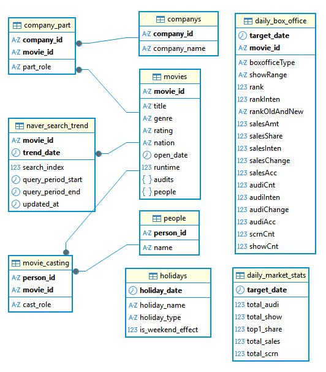
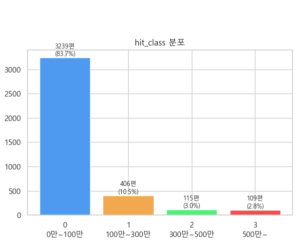
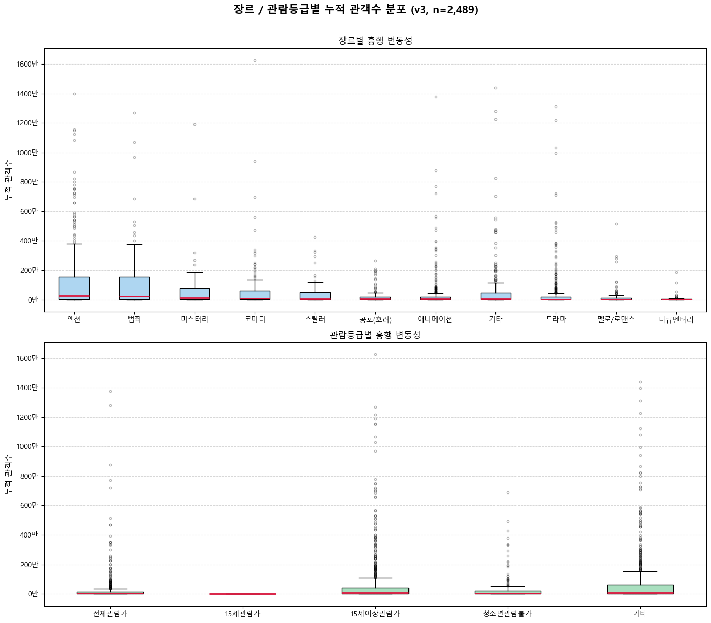
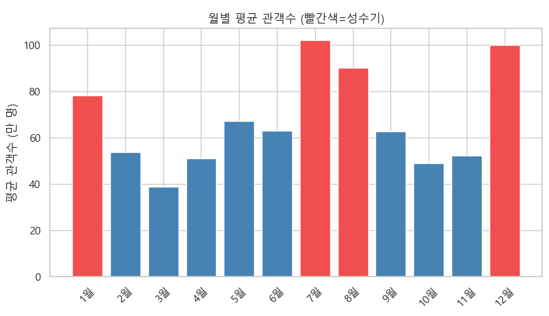

# 인공지능 데이터 전처리 결과서

---

# 1. 데이터 수집 개요

  * **1.1. 수집 목적 및 비즈니스 정의**:
    * **배경 및 필요성**:
      영화 산업은 제작 및 배급에 수십에서 수백억 원의 자본이 투입되는 반면, 흥행 성공률의 변동성이 매우 높은 대표적인 고위험(High-Risk) 산업입니다. 기존의 배급 및 마케팅 전략 수립 과정은 주로 현업 기획자의 직관과 주관적인 경험에 의존해 왔으나, 이는 예측의 일관성과 정량적 근거가 부족하다는 한계가 있었습니다. 이에 과거 상영작들의 정형/비정형 데이터를 기반으로 한 객관적인 기획·의사결정 보조 시스템의 구축이 요구됩니다.

    * **비즈니스 시나리오 및 예측 시점**:
      본 프로젝트는 **'영화 개봉 전(최종 라인업 및 개봉일 확정 시점)'** 을 가상의 예측 시점으로 설정합니다. 따라서 개봉 이후에 확정되는 현장 변수(첫 주 스크린 수, 초기 관객 평점, 상영 점유율 등)의 활용을 원천 차단하고, **개봉 이전에 확보 가능한 고정 메타데이터**(기본 영화 정보, 제작/배급사 파워, 출연진/감독 흥행 이력, 개봉 시즌 경쟁도, 개봉 전 네이버 검색 트렌드 등)만을 활용하여 누적 관객수를 예측합니다.

    * **비즈니스 활용 및 기대 효과**:
      1. **마케팅/배급 전략 최적화**: 예측된 흥행 규모(관객수 구간)에 맞춰 마케팅 예산(P&A 비용) 규모를 차등 배정하고 효율적인 배급망을 확보합니다.
      2. **리스크 통제 (손익분기점 검토)**: 순제작비 대비 예상 수익 모델을 시뮬레이션하여 리스크가 높은 작품의 배급 비중을 낮추거나, 개봉 시점을 경쟁 강도가 낮은 시기로 조정하는 의사결정을 보조합니다.

    * **분석 문제의 정의**:
      * **회귀(Regression) 문제**: 최종 누적 관객수(`total_audience`) 및 왜곡 완화를 위한 로그 변환 타겟(`log_audience`)을 정밀 예측합니다. 분류 문제(`hit_class`)는 초기 v1에서 시도하였으나 극심한 클래스 불균형으로 인해 v2부터 제거하고 회귀 문제에 집중합니다.

  * **1.2. 원천 데이터 소스 및 API 구조**:
    * **수집 채널 및 연동 API 구성**:
      본 프로젝트는 신뢰할 수 있는 공공 영화 데이터와 국내 최대 포털의 트렌드 지표를 이원화하여 수집하였습니다.
      1. **영화진흥위원회(KOBIS) Open API**: 박스오피스 목록, 영화 기본 정보, 영화사 및 영화인 정보 수집을 위한 핵심 소스입니다.
      2. **네이버 검색어 트렌드 API (Naver Data Lab)**: 영화 개봉 전 네티즌들의 상대적 검색량 변화를 수집하여 대중의 사전 관심도(Buzz) 피처를 생성하기 위한 외부 소스입니다.

    * **연계 호출 구조 및 수집 파이프라인**:
      원천 데이터의 무결성을 유지하며 효율적으로 적재하기 위해 다음과 같은 단계별 연계 호출(Cascade Request) 메커니즘을 적용하였습니다.
      ```mermaid
      graph TD
          A[일별 박스오피스 API 호출] -->|영화 코드 추출| B[영화 상세 정보 API 호출]
          B -->|영화인 코드 추출| C[영화인 상세 정보 API 호출]
          B -->|영화사 코드 추출| D[영화사 상세 정보 API 호출]
          B -->|영화명 & 개봉일 추출| E[네이버 검색 트렌드 API 호출]
      ```
      * **1단계**: 일별 박스오피스 API(`get_daily_box_office`)로 박스오피스에 진입한 이력이 있는 영화 고유 코드(`movie_cd`) 리스트를 선별 및 중복 제거합니다.
      * **2단계**: 추출된 영화 코드를 key로 삼아 영화 상세 정보 API(`get_movie_info`)를 호출하고 장르, 런타임, 관람등급 등 기본 메타와 감독/배우의 고유 인물 코드, 제작/배급사 코드를 추출합니다.
      * **3단계**: 수집된 인물 및 회사 코드를 바탕으로 영화인 상세 API(`get_people_info`) 및 영화사 상세 API(`get_company_info`)를 연쇄적으로 호출하여 세부 이력을 수집합니다.
      * **4단계**: 영화의 국문 타이틀과 개봉일 정보를 기반으로 개봉 전 30일간의 네이버 검색 트렌드 API(`get_naver_search_trend`)를 호출하여 일별 Buzz 지표를 확보합니다.

  * **1.3. 관계형 데이터베이스 스키마 설계**:
    * **전체 ERD 관계도**:

      *(DBeaver 등 DB 클라이언트 도구에서 도출한 물리 ERD 이미지 스크린샷 배치 영역)*

      

    * **엔티티 간 핵심 논리적 관계 (Cardinality)**:
      * **영화(`movies`) 중심의 물리/논리적 관계**:
        * **`movies` : `people` (N:M 다대다 관계)**
          중간 매핑 테이블인 `movie_casting`을 매개로 구현합니다. 한 편의 영화에는 다수의 감독 및 배우가 존재하며, 개별 영화인 또한 커리어 동안 여러 작품에 기여합니다. (ML 활용: 과거 이력을 역산한 Star Power 점수 산출)
        * **`movies` : `companys` (N:M 다대다 관계)**
          중간 매핑 테이블인 `company_part`를 매개로 구현합니다. 한 편의 영화는 제작사, 배급사 등 복수의 파트너사와 매핑되며, 개별 영화사 또한 다수의 영화 제작/배급에 참여합니다. (ML 활용: Brand Power 피처 도출)
        * **`movies` : `naver_search_trend` (1:N 일대다 관계)**
          영화당 개봉일 이전 30일간의 일별 관심 트렌드가 수집됩니다. (ML 활용: 개봉 전 Buzz 강도 추출)
        * **`movies` : `daily_box_office` (1:N 일대다 관계, 논리적)**
          개봉 이후 상영일 수만큼 일별 실적 데이터가 행으로 적재됩니다. (ML 활용: `MAX(audiAcc)`를 추출하여 최종 예측 타겟 변수로 변환)
      * **일자(`target_date`) 중심의 분석용 결합 관계**:
        * **`daily_box_office` : `daily_market_stats` (N:1, 논리적 결합)**
          특정 일자의 개별 영화 박스오피스 실적은 당일 시장 총규모 통계 단일 레코드와 일자 기준으로 매핑됩니다. (ML 활용: 시장 경쟁도 피처, 관람료 역산)
        * **`daily_box_office` : `holidays` (N:1, 논리적 결합)**
          영화의 개봉일 또는 특정 상영일자가 법정 공휴일 및 연휴 캘린더 데이터와 일자 기준으로 결합됩니다. (ML 활용: 시즌성 가중치 및 연휴 버프 피처 생성)

    * **테이블별 비즈니스 역할 및 ML 활용처**:

      | 테이블명 | 주요 관리 데이터 | ML 변수 활용 |
      | :--- | :--- | :--- |
      | `movies` | 장르, 국가, 등급, 상영시간 | 핵심 영화 프로필 피처의 기준선 |
      | `people` / `movie_casting` | 감독, 주연 및 조연 인적 구성 정보 | 과거 흥행 기여도 → **Star Power 피처** 생성 |
      | `companys` / `company_part` | 제작사 및 배급사 정보 | 배급 네트워크 역량 수치화 → **Brand Power 피처** 생성 |
      | `daily_box_office` | 일별 순위, 관객수, 매출액, 스크린 수 | **Target 변수(누적 관객/매출)** 도출원 |
      | `daily_market_stats` | 날짜별 시장 총규모, 1위 점유율 | 시장 활성도 파악, **관람료 역산** (`total_sales / total_audi`) |
      | `holidays` | 법정 공휴일, 황금 연휴 정보 | 개봉 시점의 **시즌성/연휴 피처** 생성 |
      | `naver_search_trend` | 개봉일 이전 30일간의 검색 트렌드 | 사전 관심 및 화제성 → **Buzz 피처** 생성 |

  * **1.4. 데이터 적재 규모 및 범위**:
    * **수집 대상 범위 및 기간**:
      * **시간적 범위**: 2010년 1월 1일 ~ 2025년 12월 31일까지 총 16년 범위의 데이터를 아우릅니다.
      * **대상 영화 규모**: 총 `3,943`편의 영화에 대해 정합성 높은 메타데이터와 시계열 실적 데이터를 구축하였습니다.

    * **테이블별 물리적 적재 현황 (요약 표)**:

      | 테이블명 | 실제 적재 건수 (Rows) | 데이터의 물리적 성격 및 범위 |
      | :--- | :--- | :--- |
      | `movies` | **3,943 건** | 분석 대상이 되는 고유 영화 마스터 데이터 (장르, 국가, 등급, 상영시간) |
      | `daily_box_office` | **58,440 건** | 각 영화가 상영된 기간 동안 기록한 일별 박스오피스 시계열 실적 (누적 관객 산출용) |
      | `daily_market_stats` | **5,844 건** | 수집 기간인 16년(약 5,844일) 동안의 일별 시장 총규모 (총 관객수, 1위 점유율) |
      | `companys` | **1,314 건** | 제작 및 배급에 참여한 고유 영화사 정보 |
      | `company_part` | **6,966 건** | 특정 영화와 영화사 간의 참여 역할(제작/배급/수입 등) 매핑 관계 |
      | `people` | **18,279 건** | 영화에 참여한 고유 영화인 (감독, 배우, 스태프 등) 정보 |
      | `movie_casting` | **50,575 건** | 특정 영화와 영화인 간의 캐스팅 역할(감독, 주연, 조연 등) 매핑 관계 |
      | `naver_search_trend` | **83,575 건** | 개봉 전 네이버 포털 내 상대 검색 지수 시계열 (화제성 분석용) |
      | `holidays` | **204 건** | 수집 기간 내 발생한 주요 법정 공휴일 및 황금연휴 정보 |

    * **적재 데이터의 관계적 특징 및 유의미성**:
      * **영화별 박스오피스 시계열 밀도**: 전체 영화 3,943편 대비 일별 박스오피스 데이터가 58,440건 적재되어, 영화당 평균 약 **14.8일**간의 일별 상영 이력이 존재합니다.
      * **네트워크 피처 구축 잠재력**: 영화인 매핑 50,575건(영화당 평균 약 12.8명 참여) 및 영화사 매핑 6,966건(영화당 평균 약 1.7개사 참여)이 적재되어, **Star Power** 및 **Brand Power** 파생 피처를 충분한 모집단 하에서 편향 없이 계산할 수 있는 무결성을 확보했습니다.
      * **Buzz 데이터 결합도**: 네이버 검색 트렌드가 총 83,575건 적재되어 영화 한 편당 개봉 전 평균 약 **21.2일**간의 연속적인 일별 관심도 변화 추이를 추적할 수 있습니다.

---

# 2. EDA 시각화 및 분석

  * **2.1. 타겟 변수(관객수) 분포 및 변환 필연성**:
    * **타겟 데이터의 우편향성**:
      영화 흥행 데이터는 소수의 메이저 대작이 관객수를 독점하고 대다수 영화는 하위 구간에 분포하는 극단적인 우편향(Right-Skewed) 롱테일 분포를 띱니다.

      > 📌 **[이미지 삽입 위치 1]**
      > **내용**: 원본 `total_audience` 히스토그램 (우편향 분포) + `log_audience` 히스토그램 (정규분포 근사) **2-panel 비교**
      > **권장 배치**: 좌우 나란히 배치하여 변환 전/후 대비 효과 극대화

    * **로그 변환(`np.log1p`) 적용 이유**:
      스케일 편차가 극심한 상태로 회귀 모델을 학습할 경우, 손실 함수(Loss)가 상위 대작 영화의 오차에만 지배되는 편향(Bias)이 발생합니다. 이에 타겟 분포의 왜도를 낮추고 학습의 수렴 안정성을 확보하기 위해 `np.log1p` 변환을 적용합니다.

    * **비즈니스 환원 (`np.expm1`)**:
      모델 학습 및 평가는 로그 스케일로 수행하되, 최종 예측값 리포팅 단계에서는 역변환 함수인 `np.expm1`을 적용하여 직관적인 관객수 수치로 복원합니다.

      | 구분 | 변수명 | 변환 함수 | 활용 단계 |
      | :--- | :--- | :--- | :--- |
      | 원본 타겟 | `total_audience` | — | 최종 리포팅, 의사결정 |
      | 로그 변환 타겟 | `log_audience` | `np.log1p` | 모델 학습 및 내부 평가 |
      | 역변환 복원 | `pred_audience` | `np.expm1` | 예측 결과 해석 |

  * **2.2. 클래스 불균형 문제 및 분류 타겟 폐기 배경**:
    * **초기 분류 설계 (`hit_class`)**:
      v1 설계 시, 누적 관객수를 4구간으로 분류하는 `hit_class` 변수를 타겟으로 활용하였습니다.

      | 클래스 | 관객수 구간 | 비고 |
      | :--- | :--- | :--- |
      | 0 | 100만 명 미만 | 흥행 부진 |
      | 1 | 100만 ~ 300만 명 | 손익분기점 전후 |
      | 2 | 300만 ~ 500만 명 | 중흥행 |
      | 3 | 500만 명 이상 | 대흥행 |

    * **클래스 불균형 심각성 및 2클래스 재설계**:
      4구간 분류에서 클래스 간 샘플 수 불균형이 극심하게 나타나, 이진 분류(100만 미만 / 100만 이상)로 재설계하였으나 예측력 향상이 제한적이었습니다.

       
      > **내용**: `hit_class` 클래스별 샘플 수 분포 막대 그래프 — 클래스 불균형 정도를 시각적으로 표현

    * **v2부터 분류 타겟 완전 폐기**:
      영화 흥행 데이터의 구조적 특성상 클래스 불균형이 해소 불가능한 수준으로 판단하여, **v2부터 `hit_class`를 피처셋에서 완전히 제거**하고 회귀(Regression) 문제에 집중합니다.

  * **2.3. 장르/관람등급별 흥행 변동성 분석**:
    * **분석 목적**:
      장르 및 관람등급별 흥행 결과의 **상하한 분산(Variance) 및 이상치(Outlier) 분포**를 Boxplot으로 시각화하여 트리 계열 모델의 분기 기준 변수로서의 중요성을 검증합니다.

      
      > **내용**: 장르별 + 관람등급별 누적 관객수 Boxplot **2-panel**
      > **권장 배치**: 상하 또는 좌우 세트 배치

    * **주요 관찰**:
      * 액션, 범죄, 코미디 등 메인스트림 장르는 중앙값은 높으나 상위 이상치와의 격차가 커 **고위험-고수익 구조**를 보입니다.
      * v3에서 관람등급을 `rating_전체관람가`, `rating_15세관람가`, `rating_15세이상관람가`, `rating_청소년관람불가` 4개 컬럼으로 원-핫 인코딩(OHE) 처리하여, 등급 제한이 흥행 상한에 미치는 영향을 모델이 직접 학습할 수 있도록 설계하였습니다.

  * **2.4. 개봉 시점의 성수기(시즌) 및 경쟁 강도 분석**:
    * **성수기 데이터 근거**:
      실제 데이터 집계 결과, 성수기(`is_peak_season = 1`)와 비성수기 간 평균 관객수 차이가 통계적으로 유의미하게 확인되었습니다.

      | 시즌 구분 | 해당 월 | 평균 관객수 |
      | :--- | :--- | :--- |
      | 여름 성수기 | 7월, 8월 | 약 **963,585명** |
      | 겨울 성수기 | 12월, 1월 | 약 **892,736명** |
      | 비성수기 | 나머지 월 | 약 **544,607명** |

      성수기 영화는 비성수기 대비 약 **1.6 ~ 1.8배** 높은 평균 관객수를 기록하여 `is_peak_season` 피처의 유효성이 검증되었습니다.

      
      > **내용**: 개봉 월별 평균 관객수 바 차트 — 성수기(7, 8, 12, 1월) 구간 강조 표시

    * **동시 개봉 경쟁 강도 (`same_week_releases`) 분석**:
      개봉일 기준 ±3일 내 동시 개봉 신작 수가 증가할수록 개별 영화의 누적 관객수가 감소하는 **음의 상관관계**를 확인하였습니다.
    
      > 📌 **[이미지 삽입 위치 5]**
      > **내용**: `same_week_releases`(X축) vs `total_audience`(Y축) 산점도 + 회귀 추세선

  * **2.5. 코로나 기간(COVID-19) 외부 충격 분석**:
    * **데이터 근거**:
      코로나19 영향 구간(2020-02-01 ~ 2022-03-31) 내 개봉 영화의 평균 관객수는 **약 294,400명**으로, 코로나 이전(Pre-COVID) 평균 **836,858명** 대비 약 **64% 급감**하였습니다. 이는 단순 시즌성 변동이 아닌 외부 충격(External Shock)에 해당하므로, `is_covid_period` 이진 플래그로 별도 포착합니다.

      > 📌 **[이미지 삽입 위치 6]**
      > **내용**: 연도별 평균 관객수 추이 라인 차트 — 코로나 구간(2020~2022) 음영 처리로 외부 충격 시각화

  * **2.6. 개봉 전 대중 관심도(Naver Buzz) 빌드업 분석**:
    * **D-7 ~ D-1 검색 트렌드 분석**:
      개봉 직전 7일간(`trend_pre7_avg`, `trend_pre7_max`)의 검색 지수와 개봉 전 30일 대비 개봉 직전 7일의 검색 증가율(`trend_growth_rate`)을 피처로 활용합니다. 흥행 성공작은 개봉 2~3주 전부터 검색량이 가파르게 증가하는 **선행 빌드업** 패턴을 보입니다.

    * **상대 검색 점유율 (`relative_search_share`)**:
      동기간(개봉일 기준 D-30 이내) 개봉 경쟁작 Top 5의 검색량 합계 대비 해당 영화의 검색량 비율로 산출하여, 절대 검색량이 아닌 **시장 내 상대적 화제성**을 포착합니다.

      > 📌 **[이미지 삽입 위치 7]**
      > **내용**: 흥행 성공 그룹 vs 흥행 부진 그룹의 D-30 ~ D-1 평균 검색 트렌드 시계열 비교 라인 차트

  * **2.7. 피처 간 다중공선성(Multicollinearity) 분석**:
    * **분석 목적**:
      Star Power 및 Brand Power 등 유사 흥행 이력 기반 변수들 간의 상관관계를 Pearson 상관계수 히트맵으로 시각화하여 다중공선성 문제를 사전 탐지합니다.

    * **주요 발견 및 조치**:
      * `director_avg_audi`와 `lead_actor_avg_audi` 간 상관관계가 높게 나타나는 경향이 있어, 동일 블록버스터 필모그래피를 공유하는 배우-감독 조합에서 이중 가중치 발생 위험이 존재합니다.
      * Ridge/Lasso 선형 모델 적용 시 해당 변수 쌍을 선별적으로 제어하며, 트리 기반 앙상블 모델(XGBoost, LightGBM)은 비선형 구조로 다중공선성에 상대적으로 강건하여 전체 피처를 유지합니다.

      > 📌 **[이미지 삽입 위치 8]**
      > **내용**: 수치형 독립변수 전체에 대한 Pearson 상관계수 히트맵
      > **권장 배치**: 전체 너비 단독 이미지로 배치 (가독성 확보)

---

# 3. 피처 엔지니어링 설계

  * **3.1. 피처 설계 원칙 및 데이터 누수(Data Leakage) 통제**:
    * **시간적 격리 원칙**:
      타겟 영화 $X$의 개봉일 $D_X$를 기준점으로 설정하고, 피처 생성 대상 데이터 범위를 $D < D_X$인 과거 레코드로만 엄격히 제한합니다. 개봉 이후 시점의 정보가 모델에 사전 주입되어 정확도가 허구적으로 과대평가되는 **데이터 누수(Data Leakage)**를 원천 방지합니다.
    * **미래 시점 피처 원천 배제**:
      `daily_box_office` 테이블의 상영 횟수(`showCnt`), 당일 스크린 수(`scrnCnt`), 좌석 점유율 등 개봉 전에는 알 수 없는 일별 변수들은 피처 테이블 구성 시 drop 처리합니다.

  * **3.2. Star Power 피처 (출처: `people` + `movie_casting` + `daily_box_office`)**:
    * **핵심 원칙**: 해당 영화 개봉일 이전의 과거 실적만 참조하여 데이터 누수를 방지합니다.
    * **산출 공식**:

      director_avg_audi(X) = (1/N) * Σ total_audience(f_i),  where open_dt(f_i) < D_X

    * **Cold Start 처리**: 신인 감독/배우 등 과거 데이터가 없는 경우 → **0** (모델이 '검증된 실적 없음'으로 해석)
    * **신인 여부 플래그**: v2부터 `is_new_director`, `is_new_lead` 이진 플래그를 추가하여 Cold Start 케이스를 모델이 명시적으로 구분할 수 있도록 보완합니다.

    | 피처명 | 타입 | 의미 |
    | :--- | :--- | :--- |
    | `director_avg_audi` | float | 감독의 과거 영화 평균 관객수 |
    | `director_movie_count` | int | 감독의 과거 영화 편수 |
    | `lead_actor_avg_audi` | float | 주연 배우 상위 N명의 평균 관객수 |
    | `lead_actor_movie_count` | int | 주연 배우 평균 과거 편수 |
    | `cast_max_star_power` | float | 출연진 중 최고 평균 관객수 (스타 1명 효과 포착) — **v1/v2만 포함, v3에서 제거** |
    | `is_new_director` | int | 신인 감독 여부 (v2~, 0/1) |
    | `is_new_lead` | int | 신인 주연배우 여부 (v2~, 0/1) |

  * **3.3. Brand Power 피처 (출처: `companys` + `company_part` + `daily_box_office`)**:
    * **핵심 원칙**: Star Power와 동일하게 개봉일 이전 과거작만 참조합니다. 배급사(마케팅/배급망 역량)와 제작사(제작 품질 역량)를 분리하여 피처를 생성합니다.
    * **신인 여부 플래그**: v2부터 `is_new_producer`, `is_new_distributor` 이진 플래그를 추가합니다.

    | 피처명 | 타입 | 의미 |
    | :--- | :--- | :--- |
    | `distributor_avg_audi` | float | 배급사의 과거 영화 평균 관객수 |
    | `distributor_movie_count` | int | 배급사의 과거 영화 편수 |
    | `producer_avg_audi` | float | 제작사의 과거 영화 평균 관객수 |
    | `producer_movie_count` | int | 제작사의 과거 영화 편수 |
    | `is_new_producer` | int | 신인 제작사 여부 (v2~, 0/1) |
    | `is_new_distributor` | int | 신인 배급사 여부 (v2~, 0/1) |

  * **3.4. 경쟁 환경 및 시장 피처 (출처: `daily_box_office` + `daily_market_stats`)**:

    | 피처명 | 타입 | 의미 |
    | :--- | :--- | :--- |
    | `same_week_releases` | int | 개봉일 ±3일 내 다른 신작 수 (경쟁 강도) |
    | `market_avg_audi_7d` | float | 개봉 직전 7일 시장 평균 관객수 (시장 활성도) |
    | `ticket_price_pre30` | float | 개봉 직전 30일 평균 관람료 — `total_sales / total_audi`로 역산 (v2~) |

    * **`ticket_price_pre30` 도입 배경**: `daily_market_stats`에서 `total_sales / total_audi`로 평균 관람료를 역산합니다. 연도별 관람료 인상(2010년 약 7,000원 → 2024년 약 14,000원)을 반영하여 `market_avg_audi_7d`의 연도 편향을 보정하고, 동일 관객수라도 연도별로 발생하는 매출 차이를 정규화합니다.

  * **3.5. 시즌성 및 공휴일 피처 (출처: `holidays` + `daily_box_office`)**:

    | 피처명 | 타입 | 산출 기준 | 의미 |
    | :--- | :--- | :--- | :--- |
    | `open_month` | int | 개봉일의 월(1~12) | 계절성 인코딩 |
    | `open_day_of_week` | int | 개봉일의 요일(0=월~6=일) | 주중/주말 개봉 효과 |
    | `is_summer` | int | 개봉 월 ∈ {7, 8} | 여름 성수기 여부 |
    | `is_winter` | int | 개봉 월 ∈ {12, 1} | 겨울 성수기 여부 |
    | `is_peak_season` | int | 개봉 월 ∈ {12, 1, 7, 8} (v2~) | 통합 성수기 여부 (실증 근거 기반) |
    | `is_holiday_release` | int | 개봉일이 법정 공휴일 또는 주말 | 공휴일 개봉 여부 |
    | `holiday_nearby_count` | int | 개봉일 ±7일 내 인접 공휴일 수 | 연휴 시너지 강도 |
    | `is_covid_period` | int | 개봉일 ∈ [2020-02-01, 2022-03-31] (v2~) | 코로나 외부 충격 구간 플래그 |

    * **`is_peak_season` 도입 근거**: 여름(7, 8월) 평균 963,585명 / 겨울(12, 1월) 평균 892,736명 vs 비성수기 평균 544,607명으로 성수기가 약 **1.6~1.8배** 높아 통계적 유효성이 확인되었습니다.
    * **`is_covid_period` 도입 근거**: 코로나 구간 평균 관객수 294,400명 vs Pre-COVID 평균 836,858명으로 **64% 급감**이 확인되어, 구조적 외부 충격을 명시적 플래그로 포착합니다.

  * **3.6. 장르 평균 관객수 피처 (`genre_avg_audi`, v2~)**:
    * 해당 영화의 장르와 동일한 장르 전체 영화의 과거 평균 관객수를 산출합니다. 장르 자체의 시장 수요 수준을 수치화하여, 원-핫 인코딩된 `genre` 피처가 포착하지 못하는 **연속형 장르 흥행 기준선**을 보완합니다.

  * **3.7. Naver Buzz 트렌드 피처 (출처: `naver_search_trend`, v2~)**:
    * 네이버 검색 트렌드 일별 시계열로부터 개봉 전 관심도의 크기, 피크, 성장률, 상대적 점유율을 스칼라 피처로 추출합니다.

    | 피처명 | 산출 방법 | 포착하는 신호 |
    | :--- | :--- | :--- |
    | `trend_pre7_avg` | D-7 ~ D-1 검색 지수 단순 평균 | 개봉 직전 1주간 관심도 크기 |
    | `trend_pre7_max` | D-7 ~ D-1 검색 지수 최댓값 | 개봉 직전 최고 화제성 피크 |
    | `trend_pre30_avg` | D-30 ~ D-1 검색 지수 단순 평균 (v3~) | 전체 사전 관심도 크기 |
    | `trend_growth_rate` | (D-7 평균) / (D-30 평균) — v2/v3 | 개봉 직전 관심도 가속도(모멘텀) |
    | `relative_search_share` | 해당 영화 D-30 평균 / 동기간 경쟁작 Top5 검색량 합 | 시장 내 상대적 화제성 점유율 |

    * **결측 처리**: 네이버 트렌드 데이터가 없는 영화(`trend_pre7_avg == 0`)는 검색 이력 부재로 간주하며 0으로 채웁니다.
    * **`relative_search_share` 산출 로직**: 개봉일 기준 D-30 이내에 개봉한 경쟁작들의 30일 평균 검색량 Top 5 합계 대비 해당 영화의 30일 평균 검색량 비율로 계산합니다.

---

# 4. 피처셋 버전별 변경 이력

  * **4.1. 버전별 개요**:

    | 버전 | 샘플 수 | 전체 컬럼 수 | 주요 변경 내용 |
    | :--- | :--- | :--- | :--- |
    | **v1** | 3,869편 | 27개 | 베이스라인 피처셋. Star/Brand Power + 시즌/경쟁 피처. 분류 타겟(`hit_class`) 포함 |
    | **v2** | 2,454편 | 39개 | Buzz 트렌드, 코로나 플래그, 성수기 통합 플래그, 장르 평균 관객수, 신인 플래그, 관람료 피처 추가. 네이버 트렌드 데이터 보유 영화로 모집단 축소 |
    | **v3 (최종)** | 2,489편 | 43개 | `hit_class` 완전 제거. 타겟에 `total_sales` 추가. 관람등급 OHE 분리(4컬럼). `cast_max_star_power` 제거. `trend_pre30_avg` 추가. `nation` 컬럼 원본 유지 |

  * **4.2. v1 피처셋 상세 (27컬럼)**:

    | 구분 | 컬럼명 | Dtype | 설명 |
    | :--- | :--- | :--- | :--- |
    | 식별자 | `movie_id` | str | 영화 고유 코드 |
    | 식별자 | `title` | str | 영화명 |
    | 영화 메타 | `runtime` | float64 | 상영시간(분) |
    | 영화 메타 | `rating_encoded` | float64 | 관람등급 (단일 인코딩) |
    | 영화 메타 | `is_korean` | float64 | 한국 영화 여부 |
    | 영화 메타 | `genre` | str | 주요 장르 |
    | 영화 메타 | `open_date` | str | 개봉일 |
    | 시즌/경쟁 | `open_month` | float64 | 개봉 월 |
    | 시즌/경쟁 | `open_day_of_week` | float64 | 개봉 요일 |
    | 시즌/경쟁 | `is_summer` | int64 | 여름 성수기 여부 |
    | 시즌/경쟁 | `is_winter` | int64 | 겨울 성수기 여부 |
    | 시즌/경쟁 | `is_holiday_release` | int64 | 공휴일 개봉 여부 |
    | 시즌/경쟁 | `holiday_nearby_count` | int64 | ±7일 내 공휴일 수 |
    | Star Power | `director_avg_audi` | float64 | 감독 과거 평균 관객수 |
    | Star Power | `director_movie_count` | int64 | 감독 과거 편수 |
    | Star Power | `lead_actor_avg_audi` | float64 | 주연배우 과거 평균 관객수 |
    | Star Power | `lead_actor_movie_count` | int64 | 주연배우 과거 편수 |
    | Star Power | `cast_max_star_power` | float64 | 출연진 최고 Star Power |
    | Brand Power | `distributor_avg_audi` | float64 | 배급사 과거 평균 관객수 |
    | Brand Power | `distributor_movie_count` | int64 | 배급사 과거 편수 |
    | Brand Power | `producer_avg_audi` | float64 | 제작사 과거 평균 관객수 |
    | Brand Power | `producer_movie_count` | int64 | 제작사 과거 편수 |
    | 경쟁 환경 | `same_week_releases` | int64 | 동주차 동시 개봉 경쟁작 수 |
    | 시장 | `market_avg_audi_7d` | float64 | 개봉 직전 7일 시장 평균 관객수 |
    | 타겟 | `total_audience` | int64 | 최종 누적 관객수 |
    | 타겟 | `log_audience` | float64 | `np.log1p(total_audience)` |
    | 타겟 | `hit_class` | int64 | 흥행 구간 분류 (v1 전용) |

  * **4.3. v2 신규 추가 피처 (v1 대비 +12컬럼, 총 39컬럼)**:

    | 구분 | 컬럼명 | Dtype | 설명 |
    | :--- | :--- | :--- | :--- |
    | Buzz 트렌드 | `trend_pre7_avg` | float64 | D-7~D-1 평균 검색 지수 |
    | Buzz 트렌드 | `trend_pre7_max` | float64 | D-7~D-1 최대 검색 지수 |
    | Buzz 트렌드 | `trend_growth_rate` | float64 | 개봉 직전 검색 증가율 |
    | Buzz 트렌드 | `relative_search_share` | float64 | 경쟁작 대비 상대 검색 점유율 |
    | 외부 충격 | `is_covid_period` | int64 | 코로나 구간 플래그 (2020-02-01 ~ 2022-03-31) |
    | 시즌 | `is_peak_season` | int64 | 통합 성수기 플래그 (7, 8, 12, 1월) |
    | 시장 | `ticket_price_pre30` | float64 | 개봉 직전 30일 평균 관람료 |
    | 장르 | `genre_avg_audi` | float64 | 동일 장르 과거 평균 관객수 |
    | 신인 플래그 | `is_new_director` | int64 | 신인 감독 여부 |
    | 신인 플래그 | `is_new_lead` | int64 | 신인 주연배우 여부 |
    | 신인 플래그 | `is_new_producer` | int64 | 신인 제작사 여부 |
    | 신인 플래그 | `is_new_distributor` | int64 | 신인 배급사 여부 |

  * **4.4. v3 변경 사항 (최종 피처셋, 43컬럼)**:

    * **제거된 컬럼**:

      | 컬럼명 | 제거 사유 |
      | :--- | :--- |
      | `hit_class` | 클래스 불균형 극심 → 분류 타겟 폐기, 회귀 문제에 집중 |
      | `cast_max_star_power` | 단일 스타 효과는 `lead_actor_avg_audi`로 포착 가능, 중복성 제거 |
      | `rating_encoded` | 단일 인코딩 → OHE 4컬럼으로 대체 |

    * **추가된 컬럼**:

      | 컬럼명 | Dtype | 설명 |
      | :--- | :--- | :--- |
      | `total_sales` | int64 | 최종 누적 매출액 (회귀 타겟 추가) |
      | `nation` | str | 제작 국가 원본값 (`is_korean` 대체) |
      | `trend_pre30_avg` | float64 | D-30~D-1 평균 검색 지수 (장기 관심도) |
      | `rating_전체관람가` | int64 | 전체관람가 OHE |
      | `rating_15세관람가` | int64 | 15세 관람가 OHE |
      | `rating_15세이상관람가` | int64 | 15세 이상 관람가 OHE |
      | `rating_청소년관람불가` | int64 | 청소년 관람불가 OHE |

---

# 5. 데이터 정제 처리

  * **5.1. 수집 한계에 따른 결측 분포 보고**:
    * **정량적 결측 비율 진단 (전체 3,943편 마스터 기준)**:

      | 결측 항목 | 결측 건수 | 결측률 | 결측 유형 | 처리 방법 |
      | :--- | :--- | :--- | :--- | :--- |
      | 관람 등급 | 25건 | 0.63% | MCAR | 최빈값(Mode) 대체 |
      | 개봉일 (`1900-01-01`) | 39건 | 0.99% | MCAR | 학습셋 완전 제외(Drop) |
      | 런타임 (0분) | 16건 | 0.41% | MCAR | 장르별 중앙값(Median) 대체 |

    * **결측 발생 원인 분석**:
      * **개봉일 미상**: KOBIS DB 상에 개봉 승인이 취소되었거나 정상적인 시계열 트랙킹이 불가능한 원로/독립영화의 전산 누락. API가 미상 케이스에 `1900-01-01`을 기본값(Sentinel Date)으로 부여합니다.
      * **런타임 0분**: 영진위 개봉 메타정보 등재 과정에서 러닝타임 수동 입력 공백 (Sentinel Value).
      * **등급 결측**: 단편 영화제 출품작 등 심의 절차가 면제되거나 보류된 케이스.

    * **모델 영향도 평가**:
      모든 개별 결측치가 전체 모집단의 **1.0% 미만**이며 특정 그룹에 밀집되지 않은 무작위적 분포(MCAR) 양상을 보입니다. 모델 가중치를 교란할 통계적 편향 위험성이 극도로 낮아 안전 구간으로 판정되었습니다.

  * **5.2. 결측치 정제 및 Imputation 로직**:
    * **런타임 0분 처리**:
      `show_tm == 0`인 레코드는 미입력 오류(Sentinel Value)로 판단하며, 동일 장르 내 영화들의 런타임 **장르별 중앙값(Median)**으로 대체합니다. 런타임 분포가 장편/단편 혼재로 인한 양봉 분포(Bimodal) 양상을 보여 평균값의 대표성이 낮으므로 중앙값을 선택하였습니다.

    * **개봉일 `1900-01-01` 처리**:
      시계열 파생 피처(Buzz 트렌드, 경쟁 강도 등)의 기준점인 개봉일 자체가 유효하지 않아 Imputation이 불가능합니다. 해당 39건은 학습셋에서 **완전 제외(Drop)** 처리합니다.

  * **5.3. 이상치 정제 및 최종 학습 모집단 확정**:
    * **제거 기준 및 결과**:

      | 제거 사유 | 제거 건수 |
      | :--- | :--- |
      | 누적 관객수 0명 이하 (비정상 흥행 기록) | 35건 |
      | 개봉일 미상 (`1900-01-01` Sentinel) | 39건 |
      | **합계** | **74건** |

      전체 수집 대상 3,943편 중 비정상 이상치 **74편을 Drop** 처리하여 **v1 기준 3,869편**의 학습 모집단으로 확정하였습니다.

    * **v2/v3 모집단 변화**:
      v2부터 네이버 검색 트렌드 데이터가 존재하는 영화로 모집단을 제한하여 **2,454편(v2)** 및 **2,489편(v3)** 으로 축소되었습니다. v2 대비 v3에서 샘플 수가 소폭 증가(+35편)한 것은 피처 재구성 과정에서 필터링 기준이 일부 조정된 결과입니다.

  * **5.4. 최종 데이터셋 무결성 검증 (QA)**:
    * **최종 스펙 (v3 기준)**: 총 **2,489편** × **43개 컬럼** (식별자 2 + 타겟 3 + 독립변수 38)
    * **결측치 제어 상태**: 모든 독립변수 및 타겟 변수 전체에 대해 **잔여 결측치 0건 (결측률 0.0%)** 확보 완료.
    * **기대 효과**: 선형 회귀(Ridge, Lasso) 및 MLP 딥러닝 계열의 연산 오류(NaN Input Crash) 가능성을 원천 차단하여 모델링 무결성을 입증하였습니다.

      > 📌 **[이미지 삽입 위치 9]** *(선택적)*
      > **내용**: 최종 피처 테이블 컬럼별 결측치 현황 히트맵 (`msno.matrix` 또는 seaborn heatmap) — 모든 셀이 완전 채워진 무결 상태 시각화
