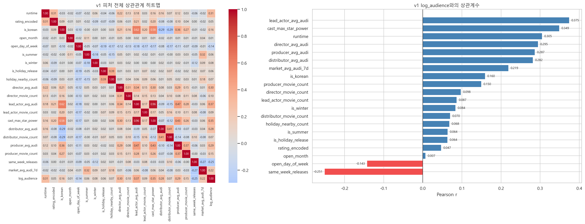
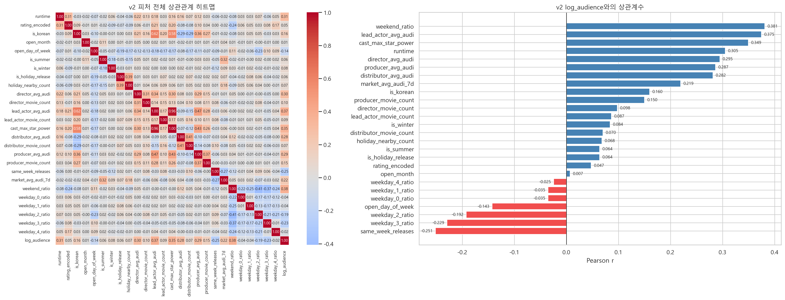
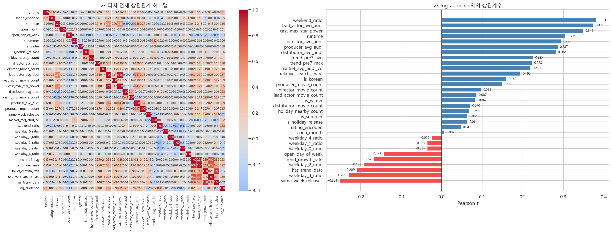
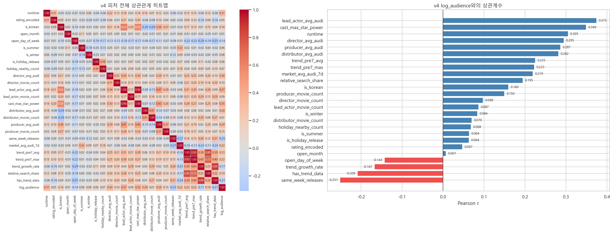

# 01_eda_baseline.ipynb 실행 결과 정리

## 목적

`feature_table_v1.csv`부터 `feature_table_v4.csv`까지 동일한 EDA 코드를 적용하여 버전별 피처 구성 차이가 `log_audience`와의 상관관계에 어떤 영향을 주는지 확인했다.

주요 확인 항목은 다음과 같다.

- 숫자형 피처 간 상관관계 히트맵
- `log_audience`와 상관계수 절대값이 큰 피처 TOP 5
- 버전별 데이터 크기 및 `hit_class` 분포

## 생성 이미지

| Version | Image |
|---|---|
| v1 | `ml/images/03_eda/05_correlation_heatmap_v1.png` |
| v2 | `ml/images/03_eda/05_correlation_heatmap_v2.png` |
| v3 | `ml/images/03_eda/05_correlation_heatmap_v3.png` |
| v4 | `ml/images/03_eda/05_correlation_heatmap_v4.png` |

### v1 correlation heatmap

### v2 correlation heatmap

### v3 correlation heatmap

### v4 correlation heatmap

## 데이터 개요

| Version | Rows | Columns | Numeric Columns | Correlation Columns | Missing Cells | hit_class Distribution |
|---|---:|---:|---:|---:|---:|---|
| v1 | 3,869 | 27 | 23 | 21 | 0 | 0: 3,239 / 1: 406 / 2: 115 / 3: 109 |
| v2 | 3,869 | 33 | 29 | 27 | 0 | 0: 3,239 / 1: 406 / 2: 115 / 3: 109 |
| v3 | 3,869 | 38 | 34 | 32 | 0 | 0: 3,239 / 1: 406 / 2: 115 / 3: 109 |
| v4 | 3,869 | 32 | 28 | 26 | 0 | 0: 3,645 / 1: 224 |

## Feature 버전별 log_audience 상관계수 TOP 5

상관계수는 `total_audience`, `hit_class`를 제외한 숫자형 피처 기준으로 계산했다.

### v1

| Rank | Feature | Correlation |
|---:|---|---:|
| 1 | lead_actor_avg_audi | 0.3747 |
| 2 | cast_max_star_power | 0.3494 |
| 3 | runtime | 0.3050 |
| 4 | director_avg_audi | 0.2950 |
| 5 | producer_avg_audi | 0.2865 |

### v2

| Rank | Feature | Correlation |
|---:|---|---:|
| 1 | lead_actor_avg_audi | 0.3747 |
| 2 | cast_max_star_power | 0.3494 |
| 3 | runtime | 0.3050 |
| 4 | director_avg_audi | 0.2950 |
| 5 | producer_avg_audi | 0.2865 |

### v3

| Rank | Feature | Correlation |
|---:|---|---:|
| 1 | lead_actor_avg_audi | 0.3747 |
| 2 | cast_max_star_power | 0.3494 |
| 3 | runtime | 0.3050 |
| 4 | director_avg_audi | 0.2950 |
| 5 | producer_avg_audi | 0.2865 |

### v4

| Rank | Feature | Correlation |
|---:|---|---:|
| 1 | lead_actor_avg_audi | 0.3747 |
| 2 | cast_max_star_power | 0.3494 |
| 3 | runtime | 0.3050 |
| 4 | director_avg_audi | 0.2950 |
| 5 | producer_avg_audi | 0.2865 |

### TOP 3 Feature

| Rank | Feature | 선정 이유 |
|---:|---|---|
| 1 | `distributor_avg_audi` | CatBoost 기준 v1, v4에서 가장 높은 중요도를 보였다. 배급사의 과거 흥행 규모가 관객 수 예측에 강하게 작용하는 피처로 판단된다. |
| 2 | `lead_actor_avg_audi` | 모든 버전의 상관관계 분석에서 상위권에 반복 등장했고, CatBoost에서도 주요 피처로 확인됐다. 주연 배우의 과거 흥행력이 예측에 안정적으로 기여한다. |
| 3 | `runtime` | v1, v4에서 상관관계와 CatBoost 중요도 모두 상위권에 위치했다. 영화 길이가 장르, 상영 전략, 관객 규모와 함께 작용하는 기본 메타 피처로 판단된다. |

## 요약

v1과 v4에서는 배우, 배급사, 러닝타임 관련 피처가 학습과 상관관계 분석에서 반복적으로 유의미하게 나타났다.

핵심 공유 대상은 `distributor_avg_audi`, `lead_actor_avg_audi`, `runtime` 3개다.
